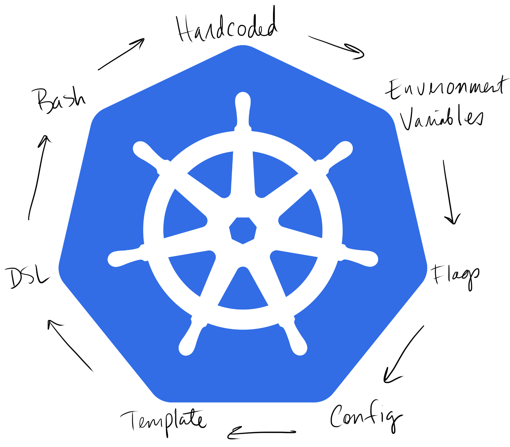

Trouble ID: `2019-08-22.gradle-deps-closure`

# Gradle 빌드스크립트가 dependency closure 때문에 너무 길어짐

## .prolog

Gradle Groovy DSL:

```
someLibraryDependencyConfigClosure = {
    exclude module: 'some-excluded-module'
}
someLibraryDependencyConfigClosureDebug = {
    changing = true
    someLibraryDependencyConfigClosure.rehydrate(this, owner, delegate).call(delegate)
}
someLibraryDependencyConfigClosureRelease = {
    someLibraryDependencyConfigClosure.rehydrate(this, owner, delegate).call(delegate)
}
```

## .text

사실 이 이야기는 Groovy 를 웬만큼 알고 있는 사람들에게는 "아 그렇구나" 싶을 정도에서 끝날 수준인데, Groovy 를 잘 모르면 대강 수박 겉핥기 하고 넘어가야 하는 내용이다.

나도 Groovy 를 많이 써 본 적이 없다. JVM 타깃으로 쓸 수 있는 언어들을 공부할 때 조금 써 봤고, Android 앱 CI 서버를 Apache Ant 로 만들던 시절에 Java 와 상호운용성 (interoperability) 좋고 런타임이 Dalvik 에서 돌릴 정도로 작은 대안 언어로 조금 써 봤다. 이후에 Android 앱의 표준 빌드 시스템이 Gradle 로 바뀌면서 빌드스크립트로만 지겹게 봤다.

많은 프로젝트가 빌드스크립트를 Kotlin Gradle DSL 기반으로 옮기고 있는 상황에서 Groovy 를 보는 건 크게 의미 없는 일일지도 모른다. 그러나 아무튼 일이 되게 해야 하지 않겠는가?

Android 앱 프로젝트는 Android Studio 템플릿에 따라 일반적으로 프로젝트 루트에 `settings.gradle` 과 `build.gradle` 이 있고 `app` 등의 서브프로젝트마다 `build.gradle` 을 보유하도록 만들어진다. 문제가 된 내 경우에는 앱의 `build.gradle` 의 `dependencies {}` 블록에 이런 Maven 라이브러리 의존성 선언 라인이 있었다.

```
debugImplementation 'some-group:some-module:some-debug-snapshot-version'
releaseImplementation 'some-group:some-module:some-version'
```

여기에서 `some-debug-snapshot-version` 은 스냅샷 저장소에 업로드되는 디버그 버전이고, `some-version` 은 릴리스 버전이다.

자주 있는 일이지만, 이 라인은 좀 더 구체적으로 보면 이렇게 생겼다.

```
debugImplementation('some-group:some-module:some-debug-snapshot-version') {
    changing = true
    exclude module: 'some-excluded-module'
}
releaseImplementation('some-group:some-module:some-version') {
    exclude module: 'some-excluded-module'
}
```

아주 축약해 뒀지만 이 라인은 실제로 보면 아주 복잡하다. 모듈 이름만으로는 협업자들에게 이것이 왜 제외되었는지에 대한 설명이 누락되기 때문이다. 실제 저 블록의 내용은 이런 식으로 만들어져야 했다. (실제 블록의 내용을 재구성했다.)

```
exclude group: 'com.android.support', module: 'appcompat-v7' // ours: 27.1.1; some-module: 27.1.1. pr #1245
exclude group: 'com.squareup.okhttp3', module: 'logging-interceptor' // ours: 3.12.1; some-module: 3.13.1. bug #3311 pr #454
exclude group: 'com.squareup.okhttp3', module: 'okhttp' // ditto
exclude group: 'org.apache.commons', module: 'commons-lang3' // exclude Commons Lang 3. Huawei. Use repackaged one. bug #171
exclude group: 'org.apache.commons', module: 'commons-io' // ours: 2.3; some-module: 2.4. bug #1096
exclude group: 'org.greenrobot', module: 'eventbus' // ours: 3.0.0; some-module: 3.1.1. pr #76
```

그런데 저 `some-module` 라이브러리가 버전 업그레이드를 거쳐 여러 라이브러리 모듈로 나뉘는 상황이 만들어진다. 이제 `dependencies {}` 블록은 이런 내용이 된다.

```
debugImplementation('some-group:some-module-types:some-debug-snapshot-version') {
    changing = true
    exclude module: 'some-excluded-module'
}
releaseImplementation('some-group:some-module-types:some-version') {
    exclude module: 'some-excluded-module'
}
debugImplementation('some-group:some-module-core:some-debug-snapshot-version') {
    changing = true
    exclude module: 'some-excluded-module'
}
releaseImplementation('some-group:some-module-core:some-version') {
    exclude module: 'some-excluded-module'
}
debugImplementation('some-group:some-module-ext:some-debug-snapshot-version') {
    changing = true
    exclude module: 'some-excluded-module'
}
releaseImplementation('some-group:some-module-ext:some-version') {
    exclude module: 'some-excluded-module'
}
```

당연히 위 블록 모두 각각 저 위의 모든 `exclude` 선언을 포함하고 있게 된다.

이제 이쯤 되면 이 블록들을 신경써서 유지보수하는 사람이 단 한 명도 남지 않는 수준까지 코드가 망가진 것이라 능히 짐작할 수 있다. 그나마 내가 이 블록들이 제때 업데이트되지 않아 라이브러리가 비정상 작동하고 있는 것은 아닌지 가장 열심히 신경쓰고 있는 사람이었다.

코드가 이 모양이면 버그 하나 잡는데 한세월이 걸린다. 중복으로 인해 실수를 제대로 교정하지 못하면 영영 잡지 못하는 일이 생길 수도 있다. 무의미한 중복은 제거하는 게 당연한 프로그래머의 미덕이다.

중복을 제거하자. 일단 블록을 모아서 이렇게 정리할 수 있다. 루트프로젝트의 `build.gradle` 에 있는 `buildscript.ext` 블록에 다음과 같이 정의하자.

```
someLibraryDependencyConfigClosureDebug = {
    changing = true
    exclude module: 'some-excluded-module'
}
someLibraryDependencyConfigClosureRelease = {
    exclude module: 'some-excluded-module'
}
```

이제 앱 서브프로젝트 `build.gradle` 의 `dependencies {}` 내부는 아래와 같이 정리할 수 있다.

```
debugImplementation('some-group:some-module-types:some-debug-snapshot-version', someLibraryDependencyConfigClosureDebug)
releaseImplementation('some-group:some-module-types:some-version', someLibraryDependencyConfigClosureRelease)
debugImplementation('some-group:some-module-core:some-debug-snapshot-version', someLibraryDependencyConfigClosureDebug)
releaseImplementation('some-group:some-module-core:some-version', someLibraryDependencyConfigClosureRelease)
debugImplementation('some-group:some-module-ext:some-debug-snapshot-version', someLibraryDependencyConfigClosureDebug)
releaseImplementation('some-group:some-module-ext:some-version', someLibraryDependencyConfigClosureRelease)
```

좋다! 6개짜리 중복을 2개로 제거했다. 여세를 몰아 루트프로젝트 `build.gradle` 의 정의를 다음과 같이 고쳐 본다.

```
someLibraryDependencyConfigClosure = {
    exclude module: 'some-excluded-module'
}
someLibraryDependencyConfigClosureDebug = {
    changing = true
    someLibraryDependencyConfigClosure.call(this)
}
someLibraryDependencyConfigClosureRelease = {
    someLibraryDependencyConfigClosure.call(this)
}
```

아&hellip; 안된다. Android Studio 에서는 Sync project with Gradle 단계를 넘지 못한다. 에러 메시지는 다음과 같다.

```
Gradle DSL method not found: 'exclude()'
```

이제 이 지점에서 해법부터 얘기하자면 Groovy 클로저에 대해 '대리자 (delegate)' 를 정확히 지정해야 하며 '수분보충 (rehydration)' 도 해 줘야 한다. 그 결과물을 tl;dr: 에 먼저 적어 뒀다.

그래서 이게 당최 무슨 말인가? 설명을 하려면 좀 긴 얘기가 될 듯하니 여기서 잠깐 끊자.

## .data

빌드스크립트 역시 코드의 일종이다. 어떤 영역에서는 그냥 빌드 프로그램이 작동할 때 참조할 값을 모아 둔 값 선언에 불과한 빌드 구성이 있고, 그게 발전하면 스크립트가 되는데, CMake 같은 도메인특화 언어가 되는 경우가 아주 많다. 빌드 시스템의 요구사항이 도메인특화 언어의 한계를 넘어 가면 그냥 셸 스크립트 러너가 되고 셸 스크립트를 쓰느니 그 빌드시스템의 구동기를 코드로 작성해 버리는 일이 생기기도 한다. Matt Rickard \[r2d4\] 는 Kubernetes 탄생에 기여한 초기 개발자이자 지금까지도 그 권위자로 (2019 년에 Google 을 퇴사함), 2019 년 1 월에 자신의 블로그에 올린 The Heptagon of Configuration 이라는 글을 올린다. 이 글은 '복잡한 시스템의 형상' 에 대한 패턴이 "왜 어디에나 Bash 스크립트가 있나" 라는 질문에 답을 준다는 이야기로 시작하는데, 농담인데 농담같지 않은 아래 이미지로 끝난다.



https://matt-rickard.com/heptagon-of-configuration/

빌드 툴체인을 거치기 전의 소스코드만 생각하면 뜬구름 잡는 이야기처럼 느껴질 법하지만, 빌드 시스템으로 맥락을 바꾸면 이 주장은 확고한 실체를 지닌다.

- Ant 는 선언형 언어인 XML 로 만들어졌지만 셸 스크립트와 별 차이가 없고, Maven 은 XML 기반으로 Ant 보다는 훨씬 잘 설계된 API 를 만들었지만 결국 XML 을 요소 순서대로 실행하게 되었다.
- CMake 는 논외로 한다. CMake 는 크로스 플랫폼 빌드 DSL 과 API 가 있지만 그 실체는 term rewriting 으로 유틸리티가 많이 확보된 셸 스크립트와 본질적으로 다르지 않다.
- 태스크 러너의 정답이 Grunt 냐 Gulp 냐 논쟁하던 Node.js 생태계는 결국 Webpack 위에 올라타는 것으로 합의를 보았다. (Grunt 는 번들링 태스크의 기본 모델에 값을 주입하는 구성을 요구하고, 이후에 나온 Gulp 는 더 작은 단위로 작업을 쪼갤 자유도를 줬다.) 오늘날 사람들은 create-react-app 을 쓰고 있다.

이제 Gradle 을 보자. Gradle 은 영리하게도 API 만 만들고 그럴듯한 DSL 을 직접 만들지 않는 전략을 택한다. 기본 Gradle 빌드 스크립트는 Groovy 로 되어 있는데 이 Groovy 는 앞서 말했듯 JVM 에서 동작하는 언어이다. 그런데 Groovy 는 JVM 에서 동작하는 스크립트 언어로 설계되었기 때문에 Groovy 런타임은 Groovy 소스 코드를 JVM 클래스파일로 보내는 컴파일러뿐만 아니라 JVM 위에서 동작하는 Groovy 소스 코드 인터프리터까지 갖추고 있다. 따라서 Groovy 에 적합한 JVM API 를 확보하면 JVM 의 이점을 취하면서 OOP bloat 를 생략하여 Java 보다 깔끔한 DSL 을 만들 수 있게 된다.

`{init,settings,build}.gradle` 파일을 작성할 때 쓰이는 Gradle Groovy DSL 이 바로 이 방식으로 만들어진 도메인특화 언어이다. 실제로 Gradle 스크립트는 평범하게 위에서 아래로 순차 실행되는 Groovy 코드이다. 그러나 예를 들어 `build.gradle` 의 `dependencies {}` 블록에 있는 `implementation '...'` 구문 등은 경험적으로 순차 실행되는 코드라기보다 선언되었다는 느낌을 주는데, 이는 Gradle 런타임이 이 블록의 Maven 라이브러리 의존성 구문들을 우선 순차적으로 읽어서 나중에 선언으로써 평가하기 때문이다. 실제 Gradle 스크립트 코드와 Gradle 런타임 클래스의 대응은 다음과 같다.

| 스크립트 코드     | 런타임 클래스                                                |
| ----------------- | ------------------------------------------------------------ |
| `settings.gradle` | [`org.gradle.api.initialization.Settings`](https://docs.gradle.org/current/dsl/org.gradle.api.initialization.Settings.html) |
| `build.gradle`    | [`org.gradle.api.Project`](https://docs.gradle.org/current/dsl/org.gradle.api.Project.html) |

이제 `dependencies {}` 블록에 대해 알아보자.

| 위치                      | 코드                            | 리시버                                               | 메소드                                                       |
| ------------------------- | ------------------------------- | ---------------------------------------------------- | ------------------------------------------------------------ |
| `build.gradle`            | `dependencies { ... }`          | JVM 리시버: `Project` 서브타입 인스턴스              | `void dependencies(Closure configureClosure);`               |
| `dependencies {}` 블록 내 | `implementation('...') { ... }` | Groovy 대리자: `DependencyHandler` 서브타입 인스턴스 | `Dependency create(String configurationName, Object dependencyNotation, Closure configureClosure);` |

이제 조금 감이 잡힐 것이다. `build.gradle` 파일 내에 `dependencies {}` 라고 쓰는 건 실제로는 어떤 실행 가능한 블록을 인자로 하여 메소드를 호출하는 것이다. Java 로 치면  `dependencies(new Closure() { ... });` 같은 코드가 될 것이다. 그러면 이 실행 가능한 블록은 현재 맥락에서 즉각 실행되지 않고 `dependencies()` 메소드의 내부 구현에 따르게 된다.

이 실행 가능한 블록의 개념이 클로저 (closure) 이다. Groovy 의 클로저는 대부분의 언어에서 느슨한 람다와 아주 비슷한 개념이다. 본래 람다는 순함수를 말하는 것이다. 그러나 Java 8 의 람다는 람다 표현식이 정의된 위치를 포함하는 클래스 인스턴스에 대한 참조를 갖는다. 반면에 Groovy 의 클로저는 Kotlin 람다와 좀 더 비슷한 개념이라고 볼 수 있다. Kotlin 에서 리시버가 있는 함수 참조를 호출할 때에는 `this` 리시버를 새로 지정할 수 있다. Groovy 는 클로저에 대해 `this`, `owner`, `delegate` 가 정의된다고 규정하는데&hellip; 아무튼 역시 리시버를 변경할 수 있다. 일반적으로 리시버를 변경할 때 쓰이는 것은 대리자 (delegate) 이다.

`Project` 유형 명세 문서에서는 `dependencies()` 에 전달되는 클로저의 `delegate` 가 `DependencyHandler` 유형이라고 명시하고 있다.

```
void dependencies (Closure configureClosure)

Configures the dependencies for this project.

This method executes the given closure against the DependencyHandler for this project. The DependencyHandler is passed to the closure as the closure's delegate. 
```

https://gradle.github.io/kotlin-dsl-docs/api/org.gradle.api/-project/index.html

`DependencyHandler` 역시 `create()` 를 호출할 때에 `configureClosure` 인자의 `delegate` 가 어떤 유형인지 명시해 주지 않을까? 아쉽게도 그렇지 않다. 이 클로저가 어떻게 실행될지는 순전히 `configurationName` 을 구현한 쪽 마음대로이기 때문이다. 예를 들어 Kotlin kapt 는 `kapt(...)` 처럼 어노테이션 프로세서를 `dependencies {}` 블록에 지정할 수 있는데 여기에 클로저를 넘기면 그냥 깔끔히 무시된다. 당연한 일이다. 

다행히 Groovy는 대놓고 약유형 언어라서 우린 이 유형에 대해 정확히 알 필요가 없다. 마지막으로 실패했던 클로저 정의가 이렇게 생겼다.

```
someLibraryDependencyConfigClosure = {
    exclude module: 'some-excluded-module'
}
someLibraryDependencyConfigClosureDebug = {
    changing = true
    someLibraryDependencyConfigClosure.call(this)
}
someLibraryDependencyConfigClosureRelease = {
    someLibraryDependencyConfigClosure.call(this)
}
```

기본적으로 Groovy 에서 클로저를 호출하는 `call()` 의 인자가 바로 `delegate` 이다. 아래와 같이 바꿔 보자.

```
someLibraryDependencyConfigClosure = {
    exclude module: 'some-excluded-module'
}
someLibraryDependencyConfigClosureDebug = {
    changing = true
    someLibraryDependencyConfigClosure.call(delegate)
}
someLibraryDependencyConfigClosureRelease = {
    someLibraryDependencyConfigClosure.call(delegate)
}
```

문제가 유지되는 상황이다. 아마 `exclude()` 가 제공되는 맥락을 대리자만으로 지정할 수는 없는 것 같다. `this`, `owner`, `delegate` 셋 다 바뀌어야 클로저 내에서 `exclude()` 를 사용할 수 있을 것이다.

Groovy 에서 이 목적으로 쓰이는 것이 바로 수분보충 (rehydration) 이다. `groovy.lang.Closure` 유형은 `rehydrate()` 메소드를 다음과 같이 정의하고 있다.

```
public Closure<V> rehydrate (Object delegate, Object owner, Object thisObject)

Returns a copy of this closure for which the delegate, owner and thisObject are replaced with the supplied parameters. Use this when you want to rehydrate a closure which has been made serializable thanks to the dehydrate() method.

Parameters:
    delegate - the closure delegate
    owner - the closure owner
    thisObject - the closure "this" object
Returns:
    a copy of this closure where owner, delegate and thisObject are replaced
Since:
    1.8.5 
```

이제 다 왔다. 아마 `dependencies {}` 블록 내의 `implementation(...)` 구문에 직접 전달한 클로저는 대리자만 교체하는 방식으로 `exclude()` 같은 메소드 참조를 제공받을 수 없었을 것이고, 실제로 Gradle 내장 `implementation` 구성이 이 클로저에 수분보충을 적용해 `this`, `owner`, `delegate` 모두 교체하여 실행하였을 것이다. 따라서 `implementation(...)` 구문에 전달한 클로저가 다른 클로저를 실행할 때 `exclude()` 같은 메소드 참조를 제공받는 맥락을 공유하려면, 대상 클로저에 수분보충을 적용하는 것이 맞다.

클로저 원본으로부터 수분보충된 사본을 만들어, 알맞은 대리자로 실행한다.  

```
someLibraryDependencyConfigClosure = {
    exclude module: 'some-excluded-module'
}
someLibraryDependencyConfigClosureDebug = {
    changing = true
    someLibraryDependencyConfigClosure.rehydrate(this, owner, delegate).call(delegate)
}
someLibraryDependencyConfigClosureRelease = {
    someLibraryDependencyConfigClosure.rehydrate(this, owner, delegate).call(delegate)
}
```

이제 중복이 완전히 제거되었고 프로젝트를 빌드할 수 있는 빌드스크립트가 완성되었다.