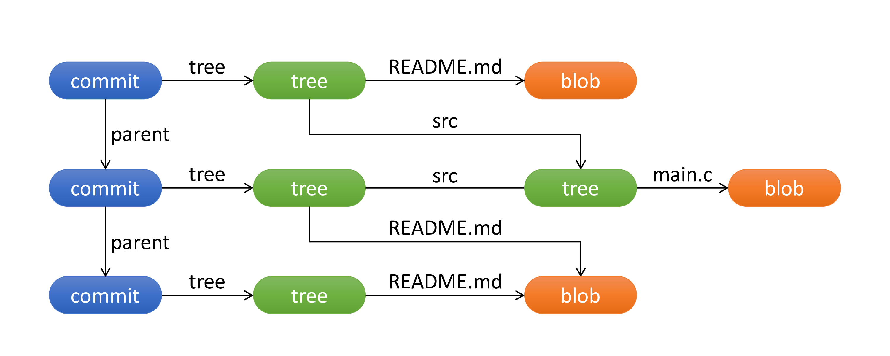
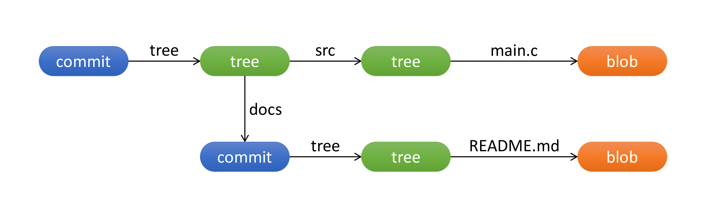
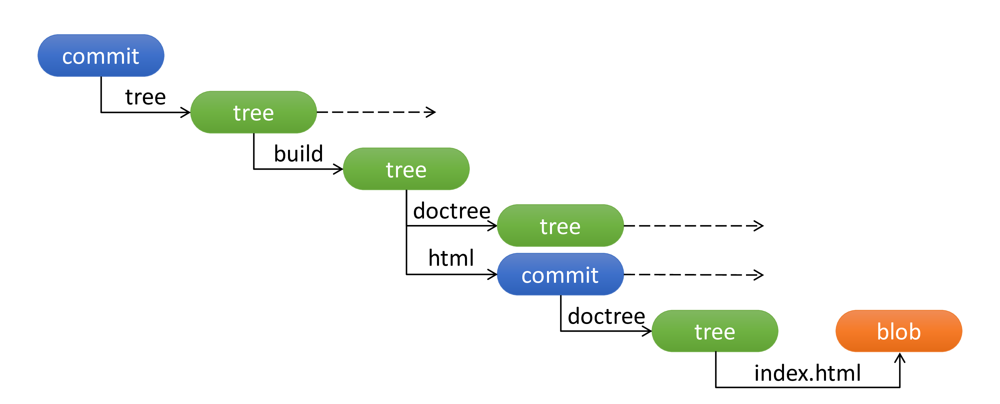
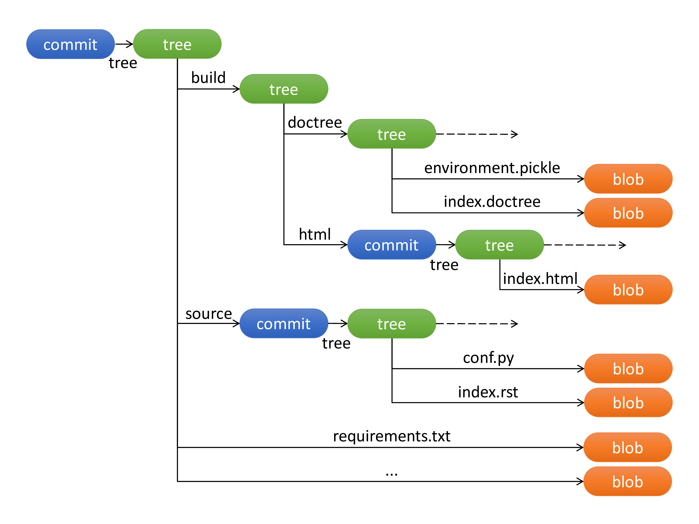
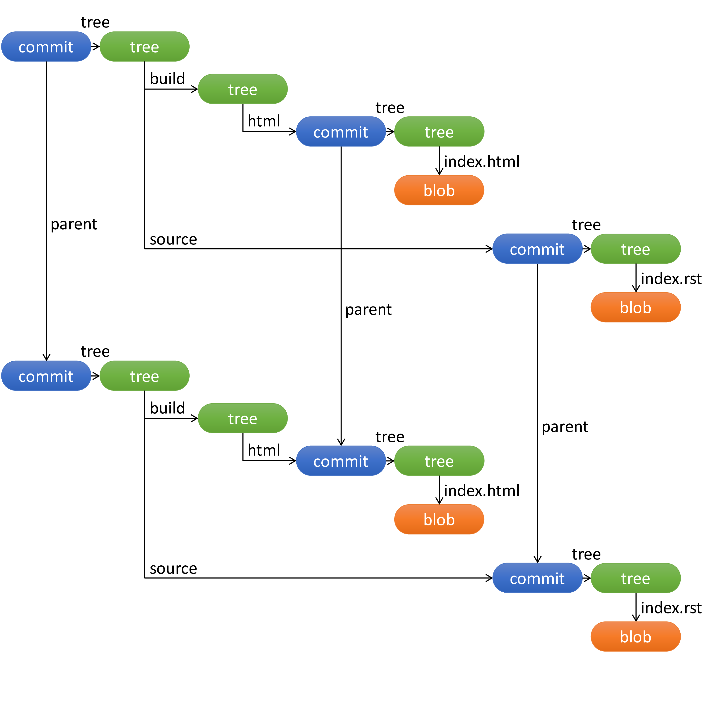

Trouble ID `2020-11-13.sphinx-builder`

# Sphinx 기반 reStructuredText 문서화 관련 자동화 구축

## Markdown 포기하는 이야기

**한동안 개발자를 위한 문서화로 Markdown 플랫폼을 활용했다.**

Markdown 은 문법이 간결하고 컴파일 에러 없는 것이 장점으로 누구든 배우기 쉬우며, 특히 GitHub 에서 이슈나 PR 을 작성하는 개발자라면 습관처럼 쓸 수 있는 마크업 언어이다. Markdown 생태계에는 Typora 같은 든든한 에디터도 있고, GitHub 에는 위키나 Pages 같은 부가 기능이 있어, 방대한 문서를 배포하기에도 Markdown 을 사용하면 좋은 조건을 갖게 되는 편이다.

그러나 문서 규모가 커지면서, Markdown 의 단점으로 인한 영향이 고작 GitHub Pages 에서 기본 제공하는 Jekyll 테마 정도 장점으로는 무시할 수 없는 수준으로 커지기 시작했다. 그나마 Markdown 특유의 파편화된 문법은 GFM 이라는 단일 실표준으로 수렴하면서 어느 정도 회피할 수 있는 문제가 되었지만, 이는 그만큼 많은 확장을 버려야 한다는 의미이기도 하다.

CommonMark 는 이용자 관점에서 이렇다할 장점은 없고 손이 많이 가는 계륵같은 표준이고, PHP Markdown Extra 나 MultiMarkdown 이나 Pandoc 은 &hellip; Docker 로 잘 준비해 둬야 CI 빌드를 돌릴 수 있을 거고. GitBook 은 드디어 레거시 CLI를 털고 서비스 솔루션만 남겨 두고 있다.

**한때 세상을 지배했던 Markdown 트렌드가 종말을 곧 맞이하겠다는 느낌을 받고 있다.**

나는 원래 이럴 때 빠르게 최신기술로 갈아타는 힙스터는 아니다. 물론 그럴듯한 최신기술이 딱히 확보된 것도 아니었다. 안정적인 미래를 도모할 수 있는 기반기술이 어디 없을까? 탐사 과정에서 나는 확장까지도 정확한 명세를 갖도록 만들어졌으며 Markdown 보다 오래된 역사로 충분히 검증된 실용적 대안을 선정하게 되었다.

**reStructuredText (reST).**

오늘날 수많은 개발 문서가 reStructuredText 로 생산되고 있다. reST 계의 베스트셀러이자 스테디셀러는 reST 툴셋인 Sphinx 로, Sphinx 기반의 Read the Docs 는 Python 이 다른 언어를 제치고 확고하게 자리잡은 현재까지 Python 과 reST 양쪽 생태계에 많은 역할을 해 준 길잡이이며 다수 개발자들에게 참조 문서의 실표준으로 간주된다. 사실상 GitBook 레거시의 원조라도 봐도 되는데, 빌드 아웃풋 형식으로 HTML 은 물론 man 페이지, ePub 파일, LaTeX 파일까지 지원하니 내공이 상당한 시스템이라는 사실을 짐작할 수 있을 것이다.

reST 문법은 조금 복잡하고 엄격한 편이다. 이 때문에 reST 는 빨리 배우고 익숙해지기에는 어렵지만, 그만큼 스타일 가이드가 사실상 불필요하다. Markdown 스타일 가이드를 지금까지 열 번도 넘게 썼던 나로서는 이런 부분이 오히려 장점으로 보였다. 명백한 단점이라면 괜찮은 에디터가 없어서 계속 html 빌드를 하면서 결과를 확인해야 한다는 것을 들 수 있겠다.

문법에 대해서야 찾아 보면 나오는 것이니 생략하고. Markdown 을 버리면서 GitHub Pages 내장 Jekyll 을 함께 쓰지 못하게 되었으니 이걸 대신해 주는 시스템을 만드는 게 급선무일 것이다.

## 문서 형상관리와 서빙 계획

**우선 스태틱 페이지 서비스 프로바이저로는 GitHub Pages 를 계속 사용하기로 했다.**

GitHub Pages 로 HTML 페이지 서빙을 하게 되면 Git 으로 소스코드를 관리하는 동시에 Git 으로 HTML 빌드 결과물도 관리한다는 이점이 생긴다. 이는 빌드 스냅샷을 보존한다는 관점에서 소스의 변화에 따른 빌드의 변화를 추적할 수 있을 뿐만 아니라 빌드의 재현가능성까지 검토해 볼 수 있는 기회가 된다.

GitHub Pages 빌트인 Jekyll 을 쓰는 것과 다른 부분이 있다면, Jekyll 에 플러그인을 적용해 직접 사용한다면 어떤 형상이 될지 생각해 보면 되겠다. 이 경우 어떤 플러그인의 어떤 버전을 사용할지, 어떤 테마를 사용할지 등에 대한 정보 역시 빌드를 재현가능하게 만들기 위해서는 필수적이다. 즉 이런 정보들도 Git 으로 관리할 형상의 일부로 취급해야 할 것이다.

물론 문서가 재현가능하게 빌드되는 것에 별 관심이 없다면 그냥 개인 블로그 하듯 느슨하게 하면 된다. 로컬에 Jekyll 설치하고, Jekyll 플러그인 설치하고, 테마 파일은 로컬에 놔두고. 로컬에서 빌드해서 커밋해서 푸시. 그 로컬 파일시스템이 유실되면 빌드 결과물은 재현될 수 없다. Jekyll 빌트인 기능은 빌드 결과물을 일정하게 생산하지만, 플러그인은 그렇지 않으니, 플러그인 버전 변경 가능성도 빌드 결과물을 재현불가능하게 만든다. 그러나 개인 블로그를 Jekyll 과 GitHub Pages 로 꾸리는 사람들 역시 이런 상황에 굳이 편안함을 느끼지는 못했을 것이다.

결론짓자면 이렇다. Jekyll 을 직접 사용한다면 문서화 프로젝트는 근본적으로 Jekyll 에 의존성이 있는 Ruby 프로젝트가 된다. Sphinx 를 사용해 문서를 직접 빌드하기 때문에 문서화 프로젝트는 근본적으로 Python 프로젝트가 된다. 즉 문서화 버전 관리 계획은 Python 프로젝트에 대한 형상관리 계획을 포함해야 한다.

## Git 서브모듈 쓰는 이야기

**Sphinx 프로젝트는 소스와 빌드를 Git 서브모듈로 관리하는 Git 브랜치로 관리하기로 했다.**

왜 이런 결정을 했는지 말하자면 많은 사람들이 끔찍하게 헷갈려하는 Git 서브모듈의 정체에 대한 이야기를 안 할 수 없겠다.

Git 에 대해 공부를 좀 한 사람이라면 Git 저장소는 오브젝트와 참조들로 이루어져 있고 Git 명령어는 그에 대한 연산이라는 것을 알고 있을 것이다. 파일시스템은 폴더와 파일로 이루어져 있고, Git 은 이를 tree 와 blob 이라는 두 가지 유형의 오브젝트로 분류한다. git-add 는 저장소 루트에서부터 파일시스템을 추적해 tree 와 blob 오브젝트로 이루어진 트리로 만들어 `.git` 폴더에 저장해 두는 연산이다.

커밋의 개념을 더하면 오브젝트 분류에 commit 이라는 세 번째 유형이 생긴다. commit 오브젝트는 Git 저장소 루트 tree 오브젝트를 참조한다. 그래서 특정 커밋을 체크아웃할 때 git-checkout 은 해당 커밋 ID 를 가진 commit 오브젝트를 찾아 저장소 루트 tree 오브젝트로부터 트리를 순회하며 Git 저장소를 특정 상태로 만들게 된다.

git-init 으로 로컬에 Git 저장소를 만들고, 저장소 루트에 README.md 파일을 추가해서 첫 커밋을 하면 실제로 아래와 같이 딱 3개의 오브젝트만 있는 저장소가 만들어진다.


이 저장소에 src/main.c 파일을 추가해서 두 번째 커밋을 하고, README.md 파일 수정을 추가해서 세 번째 커밋을 한다면, 저장소에 있는 오브젝트들의 참조 관계는 다음과 같게 된다.



Git 은 위와 같이 tree 나 blob 오브젝트가 자동으로 재사용되어 효율성을 담보하는 구조를 사용한다. 이를 위해서는 오브젝트를 참조하기 위한 단일 ID 가 필요한데, 이것이 바로 커밋 ID 에도 사용되는 SHA1 체크섬이다. Git 에서 모든 오브젝트는 그 내용을 SHA1 체크섬한 것으로 오브젝트 ID 를 갖는다. 커밋 ID 역시 commit 오브젝트의 ID 이다.

우리가 평소에 다른 ID 를 만날 일이 없으니 tree 오브젝트나 blob 오브젝트도 ID 를 갖는다는 게 조금 생소할 수 있겠는데, 여기에 Git 서브모듈 시스템이 구현되는 방법의 핵심이 있다. commit 오브젝트나 tree 오브젝트가 다른 tree 오브젝트나 blob 오브젝트를 참조할 때 오브젝트 ID 를 기입하는데, tree 오브젝트가 하위 파일 참조로 commit 오브젝트의 ID 를 기입하면 파일시스템 내에 다른 커밋을 포함하는 구조가 되기 때문이다.



위 그림은 두 커밋의 관계를 보여 주고 있다. 두 커밋은 서로 부모 관계 방향으로 관계가 없다. 한 커밋은 저장소 파일시스템에 src/main.c 파일을 포함하고 있고, 또 docs 라는 이름으로 다른 commit 오브젝트를 참조하고 있다. 참조된 커밋은 파일시스템에 README.md 파일을 포함하고 있다.

이것이 서브모듈 관계이다. Git 서브모듈은 서브모듈 폴더 하위에서 알아서 버전 관리를 해야 하며, 커밋이나 체크아웃 같은 연산도 상위 저장소와 완전히 독립적으로 이루어진다. 이것이 Git 의 단순한 구현 근본과 너무나 밀접하게 맞닿아 있는 구조이다 보니, Git 서브모듈에 대한 연산이 Git 오브젝트에 대한 원시적 연산을 그대로 노출하여, Git 을 사용하는 개발자들이 신경을 곤두세우게 되는 끔찍한 UI가 된 것이다.

그렇다면 외부 프로젝트를 코드째로 참조해야 하는 경우라면 몰라도, **내부 코드에서 Git 서브모듈을 자발적으로 써야 좋을 경우가 있긴 할까?**

`sphinx-quickstart` 를 이용해 Sphinx 프로젝트를 하나 시작해 보자. 중간에 아래와 같은 질문이 나오면 기본값인 `n` 으로 진행한다.

```
> Separate source and build directories (y/n) [n]:
```

이제 Sphinx 프로젝트 루트에서 본 하위 파일시스템은 이렇게 생겼다.

```
+-- conf.py
+-- index.rst
+-- make.bat
+-- Makefile
+-- _build/
+-- _static/
+-- _templates/
```

`_build` 폴더 하위에는 빌드 결과물이 생성되는데, `_build/doctrees/` 하위에는 Python pickle 모듈로 만든 캐시파일이 만들어지고, 빌드 명령이 `make html` 인 경우 `_build/html/` 하위에는 HTML, CSS, JavaScript 파일이 만들어진다. 

Python 프로젝트이기 때문에 Python 3 을 가정하고 venv 환경을 하나 만들자. Sphinx 도 venv 하위에 설치한다고 가정하자.

```
$ python3 -m venv venv
$ source ./venv/bin/activate
(venv) $ pip install sphinx
...
(venv) $ pip freeze > requirements.txt
```

이제 Sphinx 프로젝트 루트에 venv 폴더와 requirements.txt 파일이 추가된다.

```
+-- conf.py
+-- index.rst
+-- make.bat
+-- Makefile
+-- requirements.txt
+-+ venv/
| +-+ bin/
| | +-- ...
| +-+ include/
| | +-- ...
| +-+ lib/
| | +-- ...
| +-- pyvenv.cfg
+-- _build/
+-- _static/
+-- _templates/
```

자, 이 상태에서 동일하게 `make html` 명령을 실행하면 어떻게 될까? 갑분싸&hellip; 빌드 메시지는 venv 에 설치된 패키지들에 있는 reST 문서 파일들 때문에 난장판이 된다.

소스 폴더를 분리하자. venv 만들고, pip 로 sphinx 설치하고, `sphinx-quickstart` 에서 아래 메시지에 `y` 로 대답한다.

```
> Separate source and build directories (y/n) [n]: y
```

이제 Sphinx 프로젝트 루트에서부터 파일시스템이 이렇게 정리된다. Sphinx 3.3.1 기준. `make html` 결과.

```
+-+ build/
| +-+ doctrees/
| | +-- environment.pickle
| | +-- index.doctree
| +-+ html/
| | +-- .buildinfo
| | +-- genindex.html
| | +-- index.html
| | +-- objects.inv
| | +-- search.html
| | +-- searchindex.js
| | +-+ _sources/
| | | +-- index.rst.txt
| | +-- _static/
| | | +-- basic.css
| | | +-- doctools.js
| | | +-- documentation_options.js
| | | +-- file.png
| | | +-- jquery-3.5.1.js
| | | +-- jquery.js
| | | +-- language_data.js
| | | +-- minus.png
| | | +-- plus.png
| | | +-- pygments.css
| | | +-- pygments_dark.css
| | | +-+ scripts/
| | | | +-- main.js
| | | | +-- main.js.map
| | | +-- searchtools.js
| | | +-+ styles/
| | | | +-- styles/default.css
| | | | +-- styles/default.css.map
| | | | +-- styles/furo-extensions.css
| | | | +-- styles/furo-extensions.css.map
| | | | +-- styles/furo.css
| | | | +-- styles/furo.css.map
| | | +-- translations.js
| | | +-- underscore-1.3.1.js
| | | +-- underscore.js
+-- make.bat
+-- Makefile
+-- requirements.txt
+-+ source
| +-+ conf.py
| +-+ index.rst
| +-+ _static/
| +-+ _templates/
+-+ venv/
  +-- ...
```

자. 이제 venv 문제는 해결됐고, **빌드된 HTML 파일을 어떻게 GitHub Pages 로 스태틱 페이지 서빙 할지 궁리해 보면 된다.** `build/html/index.html` 이 Pages 웹 주소 경로 상의 최상위에 오는 게 좋기 때문에, `build/html` 을 Git 서브모듈로 만들고, `gh-pages` 브랜치에 발행한다.



**다음은 소스가 변경되었을 때 CI 가 HTML 을 빌드하도록 하고, 이 결과물을 커밋했을 때 소스와 상호 참조 가능한 기준점을 만드는 것이다.** 대부분의 경우 `requirements.txt` 는 변하지 않으므로, `source` 를 Git 서브모듈로 만들고, `src` 브랜치로 한다. 프로젝트 루트의 브랜치 이름은 `ci` 로 짓는다.



설계가 끝났다. reST 문서 소스 변경이 웹 문서 빌드 배포로 이어지는 구조는 다음과 같게 된다.

1. 리모트 `src` 브랜치가 푸시되는 경우에 대해 GitHub 시스템에서 발생시킨 웹훅 (webhook) 을 통해 CI 가 이를 인지한다.
2. CI 는 `ci` 브랜치 HEAD 를 체크아웃하고 서브모듈을 모두 init &amp; update 해서, `source` 서브모듈에 `src` 브랜치의 최신 커밋을 체크아웃한다.
3. CI 는 `build/doctrees/**`, `build/html/**` 파일을 전부 삭제한다. (유의: `build/html` 은 서브모듈이기 때문에 `build/html/.git` 파일을 유지해야 한다.) 
4. CI 는 Python 3 venv 를 생성하고, `pip install -r requirements.txt` 명령을 실행해 PyPI 패키지를 설치한 후, `make html` 명령을 실행해서 HTML 의 클린 빌드를 만든다. (유의: `make clean` 은 `build` 폴더 내부를 전부 삭제하므로 하지 않는다.)
5. `build/html` 서브모듈 저장소를 전체 커밋하고 리모트 `gh-pages` 브랜치에 푸시한다.
6. Sphinx 프로젝트 루트를 전체 커밋하고 리모트 `ci` 브랜치에 푸시한다.

이 설계의 이점은 **CI가 커밋한 것과 사람이 커밋한 것이 전혀 섞이지 않는다**는 점이다. 아주 많은 실무자들이 고의로든 실수로든 기계가 커밋을 할 수 있다는 사실을 잊는 편이다. 기계가 리모트에 올린 커밋이 있어서 이 커밋이 사람이 갖고 있는 로컬 커밋보다 일부 앞에 있다면, 사람은 이 커밋이 메인라인에 자신보다 먼저 올라와 있음을 존중해야 한다. 그런데 많은 사람들이 로컬 커밋 그래프가 앞선 부분을 리모트에 푸시 (push) 하기 위해 기계가 앞서 있는 부분을 어찌하지 못하고 리모트에 대해 풀 (pull) 을 돌려 버린다. 정말 끔찍한 일이다. 형상관리 정책의 설계에 따라, 사람에게는 사람만의 메인라인을 주고, 기계에게는 기계만의 메인라인을 주는 것이 이런 문제를 예방할 수 있는 방법이 된다.

설계의 단점이 있다면 위 파일 트리 기준으로 설정값 중 `conf.py` 는 `src` 에서 관리하지만 `requirements.txt` 는 `ci` 에서 관리한다는 것이다. 조금 검토가 필요한 부분이다. 기본적으로는 사람이 `requirements.txt` 를 편집해서 `ci` 브랜치에 올릴 수 있겠는데, `ci` 브랜치를 기계만의 메인라인으로 보장한다는 관점에서 원칙을 침해하는 면이 있다. 지금 생각하기에는 `src/requirements.txt` 로 파일을 옮겨도 될 것 같긴 한데, 검증은 되지 않았다.

## 마무리

별 것 아닌 이 문서 빌드 시스템은 지금 한 Jenkins 서버에 구현되어 실제로 작동하고 있다. 오늘도 잡설이 길었기 때문에 읽기에 따라 어렵게 느껴질 수 있으나 결국 **Git 으로 소스를 수정하고 Git으로 빌드를 발행했으며 소스 저장소와 빌드 스냅샷 저장소를 분리하면서 참조에 Git 서브모듈을 썼다**는 흔한 이야기로 요약된다.



흐름을 위해 몇 가지 디테일을 빠뜨렸으므로 이곳에 남겨 둔다.

- Git 파일시스템의 실제 구현. 파일 트리의 비단말 노드인 tree 오브젝트에서 tree, blob, commit 오브젝트를 참조할 때에는 하위 노드로 가는 이름과 오브젝트 ID 에 추가로 stat(2) 값을 포함한다. 파일은 100644 (`-rw-r--r--`) 또는 100755 (`-rwxr-xr-x`) 인 blob 참조이며 폴더는 040000 (`d---------`) 인 tree 참조이다. 심볼릭 링크는 120000 (`l---------`) 인 blob 참조로 저장된다. 서브모듈은 모드 160000 인 commit 참조이다. Git 에서 이것은 gitlink 라는 특수 파일로 간주된다.

- Python 프로젝트에서 빌드 재현성을 검증하기 위해서는 venv 를 매번 삭제하고 새로 생성해야 한다.

- 이 프로젝트에서는 `ci` 브랜치의 커밋이 해당 브랜치가 있는 같은 Git 저장소의 `gh-pages` 브랜치, `src` 브랜치의 커밋을 서브모듈로 참조했다. 이는 많은 시스템에서 정상 동작하지 않는다. `ci` 브랜치의 커밋에서 `.gitmodules` 파일 내용은 다음과 같다.

  ```
  [submodule "source"]
    path = source
    url = ./
  [submodule "build/html"]
    path = build/html
    url = ./
  ```

  Git 서브모듈 URL 은 상대경로인 `./` 나 `../` 로 시작하는 값을 허용하는데, 이는 HTTP(S) 나 SSH 리모트 저장소가 있는 환경을 위한 값이 아니다. `.gitmodules` 파일 내용이 저 상태인데 git-clone 으로 리모트 저장소를 클론한 후 git-submodule 에서 init 을 하면 서브모듈의 리모트 경로는 본래 리모트 경로 뒤에 슬래시 문자가 하나 추가된 값이 된다. (예: `https://github.com/sample/repo-url.git` :arrow_right: `https://github.com/sample/repo-url.git/`; `git@github.com:sample/repo-url.git` :arrow_right: `git@github.com:sample/repo-url.git/`.) HTTP(S) 인 경우 HTTP 서버의 리디렉션에 따라 리모트가 좋게좋게 해 줄 수 있으나 Git+SSH 인 경우 그럴 일 없다고 보면 된다. 그래서 `ci` 를 체크아웃한 후에 이런 미친 절차가 필요하다. (set-url 이 git-submodule 서브커맨드에 없다면 `.git/config` 를 수정해야 한다.)

  ```
  $ git submodule init
  $ git submodule set-url build/html $(git remote get-url origin)
  $ git submodule set-url source $(git remote get-url origin)
  $ git submodule update
  ```

  나는 Git 서브모듈 경로에 왜 이런 제약이 있는지 아직 잘 모르겠다. **어차피 Git 은 오브젝트 스토리지인데 내 커밋 그래프를 저쪽 저장소에 이름 붙여 두든 같은 저장소에 두든 무슨 상관이란 말인가?** 기본적으로 리모트가 로컬이든 HTTP(S) 든 Git+SSH 든 여러 최적화의 소지가 있고, 특히 어떤 종류의 URL 패턴은 Git 클라이언트에 검증되지 않은 위험한 동작을 초래할 수 있다는 점에서, URL 제약은 필요하다. 그러나 Git 서브모듈은 그냥 쓰기도 심각하게 거추장스러운데 심지어 다 별개의 이름을 붙인 리모트 저장소여야 한다는 제약을 강요한다. GitHub 에서는 이런 제약을 적극적으로 받아들여 메인 브랜치 헤드에서 도달 가능한 커밋만 취급한다. 나는 이 납득 불가능한 제약에 적극적으로 반항하며 살고 있는데, 언제까지 이렇게 살지 두고 보는 중이다.

- 혹시나 GitBook 레거시를 인하우스 솔루션으로 쓰다가 끈 떨어진 사람이 있다면 나는 Sphinx 로 전환하는 작업을 추천하고 싶다. 그런데 reST 편집 환경이 너무 원시적이라서 Sphinx 를 도입하는 게 정답이 되기는 어려울 수 있다.

  Sphinx 생태계가 다양한 테마와 확장으로 나날이 리즈를 갱신하고 있는 한편 reST 편집은 놀라울 정도로 지난 수 년 간 전혀 발전이 없다. Typora 는 말할 것도 없고, 하다못해 JSX 같은 환경에서는 HTML 코드도 인텔리센스 스타일로 버그를 볼 수 있으며, TeX 환경에조차 BaKoMa TeX 라는 강력한 위지윅 편집기가 있는데 말이다. 물론 reST 가 지시어 (directive) 와 역할 (role) 로 이루어져 있고 Sphinx 는 그걸 확장하기 때문에 Markdown 에 비해서는 에디터 개발에 부담을 주는 구조인 게 사실이다만&hellip;

  다만 Jekyll 은 Markdown 이기 때문에 일시적으로 문서 관련 비용이 덜 들게 되나, 플러그인 관리에 조금 골치가 아플 수 있고, Ruby 기반이라 Python 보다 빌드 파이프라인 관리에서 피로 유발이 좀 더 심할 수 있다. 또한 Jekyll 에는 PDF 빌드가 내장되어 있지 않은데, PDF 관련 플러그인을 추가하거나 직접 싱글 페이지 템플릿을 구성하고 Puppeteer 로 프린트하는 과정을 만들어야 할 것이다.

  Sphinx 에는 `latexpdf` 빌더가 있어서 LaTeX 아웃풋을 PDF 로 만드는 빌드 파이프라인이 기본 제공된다. PDF 파일은 pdflatex 로 만드는데 이를 위해 TeX 패키지인 latexmk 와 pdftex 가 있어야 하므로 이 경우 TeX Live 를 사용할 수 있는 Linux 빌드 서버를 마련한다면 가장 좋을 것이다.

  그 외에 대안이 될 만한 솔루션이 있나? Rust 툴체인에 코드 내 문서화 용도로 rustdoc 이 있고, Rust 언어 개발자들이 "The Rust Programming Language" book 을 쓰느라고 mdBook 이라는 걸 만들었는데, 이 mdBook 정도가 준수한 아웃풋을 내 주고 있긴 한다. 그런데 Rust 의 미래가 그리 희망적이지는 않은 것 같아서&hellip; 그 외엔 Bookdown 이나 Softcover 도 괜찮은 것 같다. Sphinx 처럼 ePub 아웃풋이 필요하다면 Pandoc 계열이 거의 유일한 대안이다.