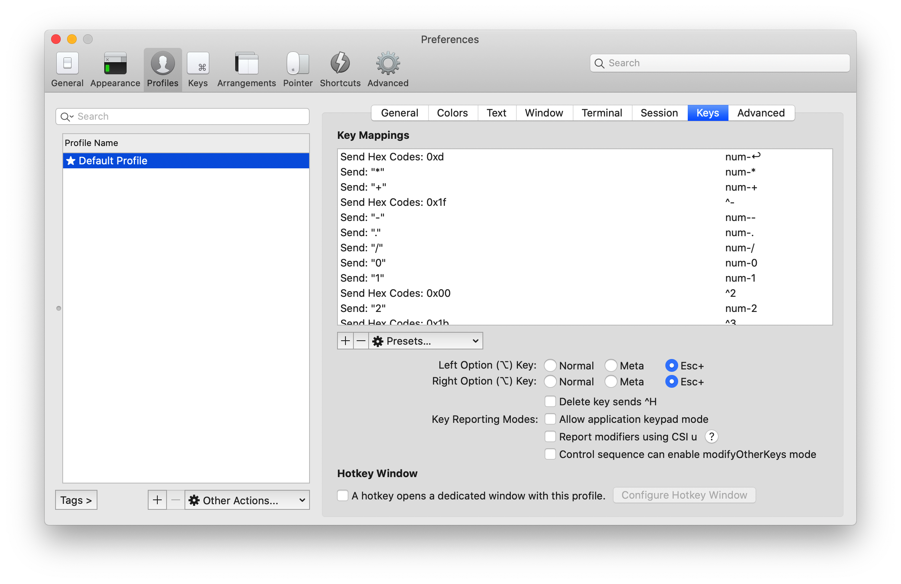

Trouble ID `2020-12-06.vim-in-iterm2-3-4-2`

# iTerm2 3.4.2 에서 Vim 을 못 쓰는 버그

어느날 iTerm2 에서 Vim 을 쓰는데 Option 키가 의도한 대로 작동하지 않기 시작했다. Option+hjkl 이 편집 모드를 끝내고 일반 모드를 시작해서 커서를 움직여야 하는데 diacritics 달린 알파벳을 넣는 것이다. Option+aios 도 마찬가지.

iTerm2 는 Profile 마다 키 동작을 결정할 수 있는데, Option 키의 동작이 Default / Meta / Esc+ 로 구분되어 있다. 분명히 이 부분을 Esc+ 로 지정해서 한동안 Option 키를 Alt 와 같은 순수 modifier 로 잘 썼다. 그런데 지난 달에도 이런 불쾌한 경험은 없었다.

아이고 내 시간 ㅠㅠ

문제는 얼마 전에 업데이트한 iTerm 3.4.2 였다.

iTerm 3.4.3 릴리즈 노트를 보자.

```
3.4.3

- Fix crashes.
- Don't allow programs to turn on
  "modifyOtherKeys" key reporting mode, which
  caused problems in vim for many users.
  This default can be changed in 
  Prefs > Profiles > Keys.
- Fix a bug where "Move Session to Window" was
  disabled in the context menu.
- Fix a bug where long URLs couldn't be
  cmd-clicked on.
- If Application Support is not writable, copy the
  server binary to ~/.iterm2
- Save restorable state when upgrading, even if
  it's normally not used.
- Fix a bug where custom status bar components
  didn't work.
- Fix a bug where the python runtime couldn't be
  downloaded.
- Bring back the ApplicationSupport symlink
  because pip3 can't handle spaces in paths.
- Fix a crash when the scripting console was open.
```

문제가 된 부분은 xterm 리소스인 modifyOtherKeys 모드이다. iTerm2 3.4.2 에서 modifyOtherKeys mode 2 의 modifier 키 지원을 개선했는데, 이게 기존에 잘 작동하던 Option modifier 의 동작 변경이 무시되도록 해 버린 것이다.

이것이 교정된 iTerm2 3.4.3 에는 "Control sequence can enable modifyOtherKeys mode" 옵션이 생겼고 이것이 자동으로 off 되어 있다.



