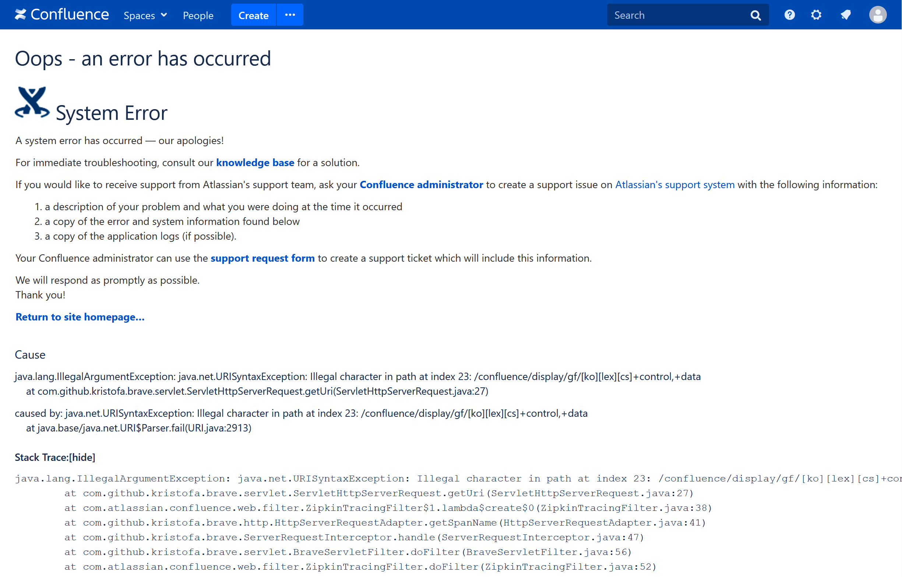

Trouble ID `2021-05-02.nginx-revproxy-for-confluence`

# Confluence 용 NGINX 리버스 프록시 구성

재작년 9 월쯤부터 **취미로 Confluence Server 를 하나 굴리는 중이다.** 그렇다 Atlassian 의 묵직하고 한번 도입하면 탈출하기가 끔찍하게 어려운 그 제품을 말하는 것이다&hellip; 애드온 많고 위지윅 잘 돌고 협업에 좋고 그냥저냥 무난한 문서화 시스템이 필요해서 미친 척하고 이걸 도입하고 말았다. 저런 좋은 특성을 가진 동시에 오픈소스라서 대체재가 많은 것은 그냥 세상에 존재하지 않는다. 적어도 2021 년까지도 어쩔 수 없는 상황이다. 그건 돈이 드는 일이고 팔려야 하니까.

몇 가지 이유에서 Confluence Server 를 지인의 홈서버에 적당히 세 들어 살다가, 홈서버가 언제나 그럴 운명에 있듯, 내 Confluence Server 역시 서비스 중단의 위기에 놓이게 됐다. 원래 이럴 생각은 아니었고 처음에는 그냥 AWS EC2 t2.micro 무료 티어를 사용했는데, 어차피 EIP 와 EBS 때문에 돈을 내야 하니 끔찍한 성능을 돈으로 해결하고자 t2.medium 으로 올려 버렸고, 그 비용을 견디지 못해 적은 돈에 더 좋은 성능의 홈서버를 쓰라는 제안을 덥석 문 것이다. ㅠㅠ

그렇게 서비스 중단이 됐던 게 작년 9 월이고 올해 3 월이 되어서야 내 서버를 살렸다. 이건 그걸 마무리하는 과정이었다. 근데 Confluence Server 의 신규 라이센스 판매는 올해 2 월에 중단되었고 2024 년 2 월까지만 서포트가 될 예정이다 \[1\]. 솔직히 Confluence Server 구성이 새로 될 만한 일은 존재하지 않을 것이다. 이건 그냥 말 그대로 개인 트러블슈팅 로그이다. 누군가에게 도움이 될 일은 없을 것 같고, 없길 바라며, 만약 이게 도움이 된다면, 건투를 빈다.

## Confluence Server 실행하기

Docker Hub 의 atlassian/confluence-server \[2\] 를 실행해 보기로 했다.

```bash
$ docker run -p 8090:8090 -p 8091:8091 atlassian/confluence-server
```

당연히 아주 잘 실행된다. 8090 은 HTTP 포트이고 8091 은 Synchrony 포트인데 8091 바인딩이 안 되어 있으면 Confluence 가 굉장히 징징대기 때문에 두 포트 리스닝 모두 발행해 주는 것이 좋다.

(이 글을 쓰는 현 시점에서 atlassian/confluence-server 의 :latest = :7.12.0 = :7.12.0-ubuntu = sha256 f4a3bff358381d216864ff8aeca59cd6de150f35a31b65ac68990ff23a84f261 이다. 환경 변수 설정 역시 현재 문서를 기준으로 한다.)

남은 것은 컨테이너 파일시스템의 `/var/atlassian/application-data/confluence` 위치를 `-v` 옵션으로 볼륨마운트해 주는 것이다. **처음부터 볼륨마운트를 거는 것이 중요한데,** `docker run` 이후에 볼륨마운트를 변경하려면 일단 `docker commit` 을 해서 현재 상태로 컨테이너를 만들고 이걸 또 다시 볼륨마운트를 추가해서 새로이 `docker run` 하는 과정이 필요하다. 이는 즉 위 경로를 새로 볼륨마운트하는 경우 Confluence 서비스 프로세스가 살아 있는 상태에서 데이터 디렉토리를 비워야 한다는 것인데, 저 데이터 디렉토리는 Confluence 서비스 프로세스가 실행되면서 락을 걸고 빈 디렉토리인 경우 템플릿을 파일시스템에 채우는 것이기 때문에, 당연히 둘도 없이 문제가 생기게 된다. 그렇다고 Confluence 서비스 프로세스를 종료시켜 버리면 Docker 컨벤션에 따라 컨테이너의 엔트리포인트도 함께 프로세스 종료되고 컨테이너를 커밋할 수 없다. 답은 처음부터 볼륨마운트를 하는 것뿐임을 알 수 있다. (atlassian/confluence-server 의 경우에는 `entrypoint.py` 로 되어 있다. 컨테이너의 핵심 프로세스가 종료될 경우 외부에서 이걸 알 방법은 컨테이너가 종료되는 것이기 때문에 이런 컨벤션이 있다.)

DB 백업이 있다면 이때 복원시켜도 좋다. 추후 볼륨마운트를 살려 주면 나머지 경로 전체에 Confluence Server 가 사실상 재설치되더라도 저 위치에 있는 설정값이 모든 데이터를 살려 주기 때문이다. 심지어 기본 백업 경로도 `/var/atlassian/application-data/confluence/backups` 이니까 업그레이드도 문제 없다. Docker 사랑해요 ㅠㅠ.

## Confluence Server: HTTPS Proxy 준비하기

Confluence Server 는 HTTPS 지원을 내장하고 있지 않다. 정확히는 뭐 HTTPS 지원이 내장되어 있긴 한데 Confluence Server 가 Tomcat 으로 시동줄 구성된 서블릿이기 때문이다. Tomcat 으로 HTTPS 구성을 하느니 앞에 NGINX 를 달겠다는 결정을 하는 것이 합리적이다. 이는 atlassian/confluence-server 를 썼기 때문에 더욱 합리적인 결정이 된다.

Atlassian 의 Confluence Server 서포트 문서를 보면 \[3\] Confluence Server 를 HTTPS 서비스하기 위해 Tomcat 자체 HTTPS 구성을 하는 방법과 \[4\] NGINX 로 리버스 프록시 구성을 하는 방법이 \[5\] 모두 소개되어 있다. 그런데 Tomcat 의 경우 JDK `keytool` 로 키를 생성한 후에 `server.xml` 에 이렇게 기입하는 것이 매뉴얼이다.

```xml
<Connector port="8443" maxHttpHeaderSize="8192"
   maxThreads="150" minSpareThreads="25"
   protocol="org.apache.coyote.http11.Http11Nio2Protocol"
   enableLookups="false" disableUploadTimeout="true"
   acceptCount="100" scheme="https" secure="true"
   clientAuth="false" sslProtocol="TLSv1.2"
   sslEnabledProtocols="TLSv1.2" SSLEnabled="true"
   URIEncoding="UTF-8" keystorePass="<MY_CERTIFICATE_PASSWORD>"
   keystoreFile="<MY_CERTIFICATE_LOCATION>"/>
```

이제 이걸 어떻게 넣어야 하는가? Docker Hub 문서를 보면 `ATL_TOMCAT_PORT`, `ATL_TOMCAT_SCHEME`, `ATL_TOMCAT_SECURE` 뭐 이런 환경변수를 넣으라고 되어 있는데, 좋다, 하지만 `keystorePass` 와 `keystoreFile` 값을 주입할 수 있는 환경변수 의존성 경로는 없다.

결국 NGINX 설정으로 바꾼다. NGINX 리버스 프록시 설정의 경우 `server.xml` 의 `<Connector>` 에서 `proxyName` 과 `proxyPort` 를 지정하라는 매뉴얼이 보인다.

```xml
<Connector port="8090" connectionTimeout="20000" redirectPort="8443"
   maxThreads="48" minSpareThreads="10"
   enableLookups="false" acceptCount="10" debug="0" URIEncoding="UTF-8"
   protocol="org.apache.coyote.http11.Http11NioProtocol"
   scheme="https" secure="true" proxyName="www.example.com" proxyPort="443"/>
```

위에 `docker run` 해 둔 것을 `docker stop` 이나 `docker kill` 로 멈추고 `docker rm` 으로 지운 후에, 옵션을 다시 준다.

```bash
$ docker run -e ATL_PROXY_NAME=<domain> -e ATL_PROXY_PORT=443 -e ATL_TOMCAT_CONTEXTPATH=/confluence -v <confluence-data-dir>:/var/atlassian/application-data/confluence -p 8090:8090 -p 8091:8091 atlassian/confluence-server
```

`server.xml` 의 `proxyName` 과 `proxyName` 은`ATL_PROXY_NAME` 과 `ATL_PROXY_PORT` 로 주입할 수 있다. `ATL_TOMCAT_CONTEXTPATH` 를 빼먹을 뻔했다. 이건 `server.xml` 의 `<Context>` 태그에 들어가는 `path` 값을 지정하게 해 준다.

```xml
<Context path="/confluence" docBase="../confluence" debug="0" reloadable="false">
```

이젠 정말 Confluence Server 를 재시작하지 않아도 된다. 웹페이지는 `http://localhost:8090/confluence` 에서 볼 수 있을 것이다.

## NGINX 설정하기

Atlassian 문서를 뒤지다 보면 어떤 내용이 나오고 똑같은 내용이 또 나오고 하는 걸 가끔 발견할 수 있는데, Confluence KB 를 보면 NGINX 에 대해서도 하우투 (howto) 문서가 있다. \[6\] 여기에서 Confluence v6 이상의 Synchrony 가 존재하는 서버와 v6 미만의 Synchrony 가 없는 서버에 대해 설정을 어떻게 다르게 해 줘야 하는지를 설명하고 있다.

v5 이하의 경우 Context path 를 `/confluence` 로 설정하는 건 꼭 필요한 일이 아니다. 이 경우 NGINX conf 파일은 아래와 같이 설정하게 되어 있는데, Context path 가 없어도 별 문제가 되지 않는다.

```
server {
    listen 80;
    server_name <domain>;
    location /confluence {
        proxy_set_header X-Forwarded-Host $host;
        proxy_set_header X-Forwarded-Server $host;
        proxy_set_header X-Forwarded-For $proxy_add_x_forwarded_for; 
        proxy_pass http://localhost:8090/confluence;
    }
}
```

한편 v6 이상의 경우 Synchrony 가 있다. 평문 HTTP 의 경우 Synchrony 가 웹 문서와 별도 포트를 이용하는데, HTTPS 서비스를 하는 경우 Synchrony 역시 HTTPS 를 통하게 해야 하기 때문에 path prefix 가 필요해지는 것이다. 이때 웹 문서는 `/confluence` 로 서빙하도록 Context path 를 준다. 그럼 Synchrony 는? 자동으로 `/synchrony` 에 붙는다. Synchrony 는 WebSocket 기반이기 때문에, NGINX conf 파일은 다음과 같이 설정해야 한다. (뭐 이딴 게 다 있는지; 그냥 한 포트로 듣고 애플리케이션이 알아서 한번 더 라우팅 해서 쓰면 안될까?)

```
server {
    listen 80;
    server_name <domain>;

    location /confluence {
        client_max_body_size 100m;
        proxy_set_header X-Forwarded-Host $host;
        proxy_set_header X-Forwarded-Server $host;
        proxy_set_header X-Forwarded-For $proxy_add_x_forwarded_for; 
        proxy_pass http://localhost:8090/confluence;
    }

    location /synchrony {
        client_max_body_size 100m;
        proxy_set_header X-Forwarded-Host $host;
        proxy_set_header X-Forwarded-Server $host;
        proxy_set_header X-Forwarded-For $proxy_add_x_forwarded_for;
        proxy_pass http://localhost:8091/synchrony;
        proxy_http_version 1.1;
        proxy_set_header Upgrade $http_upgrade;
        proxy_set_header Connection "Upgrade";
    }
}
```

이제 진짜 마지막이다. 알아서 키 페어를 준비해 두고 TLS 설정을 붙인다.

```
server {
    listen 80;
    server_name <domain>;

    listen 443 default ssl;
    ssl_certificate     /etc/letsencrypt/live/<domain>/cert.pem;
    ssl_certificate_key /etc/letsencrypt/live/<domain>/privkey.pem;
    ssl_session_timeout  5m;
    ssl_protocols TLSv1 TLSv1.1 TLSv1.2 TLSv1.3;
    ssl_ciphers 'ECDHE-ECDSA-CHACHA20-POLY1305:ECDHE-RSA-CHACHA20-POLY1305:ECDHE-ECDSA-AES128-GCM-SHA256:ECDHE-RSA-AES128-GCM-SHA256:ECDHE-ECDSA-AES256-GCM-SHA384:ECDHE-RSA-AES256-GCM-SHA384:ECDHE-ECDSA-AES128-SHA256:ECDHE-RSA-AES128-SHA256:ECDHE-ECDSA-AES128-SHA:ECDHE-RSA-AES256-SHA384:ECDHE-RSA-AES128-SHA:ECDHE-ECDSA-AES256-SHA384:ECDHE-ECDSA-AES256-SHA:ECDHE-RSA-AES256-SHA:ECDHE-ECDSA-DES-CBC3-SHA:ECDHE-RSA-DES-CBC3-SHA:EDH-RSA-DES-CBC3-SHA:AES128-GCM-SHA256:AES256-GCM-SHA384:AES128-SHA256:AES256-SHA256:AES128-SHA:AES256-SHA:DES-CBC3-SHA:!DSS';
    ssl_prefer_server_ciphers on;

    location /confluence {
        client_max_body_size 100m;
        proxy_set_header X-Forwarded-Host $host;
        proxy_set_header X-Forwarded-Server $host;
        proxy_set_header X-Forwarded-For $proxy_add_x_forwarded_for;
        proxy_pass http://<upstream>:8090/confluence;
    }

    location /synchrony {
        client_max_body_size 100m;
        proxy_set_header X-Forwarded-Host $host;
        proxy_set_header X-Forwarded-Server $host;
        proxy_set_header X-Forwarded-For $proxy_add_x_forwarded_for;
        proxy_pass http://<upstream>:8091/synchrony;
        proxy_http_version 1.1;
        proxy_set_header Upgrade $http_upgrade;
        proxy_set_header Connection "Upgrade";
    }
}
```

보다시피 나는 LE 를 쓰느라 Certbot 을 돌렸다. Certbot 도 Docker Hub 에서 certbot/certbot 을 받아서 돌리고 \[7\] NGINX 도 Docker Hub 에서 library/nginx 를 받아서 돌렸는데 \[8\], 사실 이 과정에서도 (굳이 이렇게 하느라) 골치가 좀 아팠다. 경로 매칭이 `^~ /confluence` 나 `^~ /synchrony` 에 붙지 않는 경우 폴백으로 어떤 파일시스템에서 파일을 보여줄지 미리 볼륨마운트 포인트를 잡아 두고, 이 부분을 Certbot 에서 NGINX 파일 경로로 지정해 주어야 한다. NGINX 마스터 프로세스 라이브니스를 위해서는 `default.conf` 까지 외부에서 공급해야 하기 때문에, NGINX 볼륨마운트는 총 3 개 그리고 Certbot 볼륨마운트는 총 2 개가 된다. 뭔가 Docker 를 쓰겠다고 주객전도가 된 느낌인데? 그래도 Docker 사랑해요 ㅠㅠ.

여기까지 하면 `<upstream>` 값이 제대로 되어 있다면 NGINX 와 Confluence 가 척 붙는다. `<domain>` 과 TLS 설정도 제대로 되어 있다면 `https://<domain>/confluence` 로 HTTPS 접속도 되고 Confluence 가 더이상 투덜거리지도 않을 것이다.

## 아직 안 끝났다

이 정도면 매뉴얼을 거의 완벽하게 따른 것이고, 이대로 문제가 잘 해결됐다면 이 글을 쓸 이유가 없었을 것이다.

미친 NGINX 는 `proxy_pass` 를 할 때 conf 파일을 위에 정상적으로 작성하면 나머지 HTTP URI component 를 unescape 해 준다. 리버스 프록시의 백엔드 역시 HTTP 서비스일텐데 NGINX 는 리버스 프록시로 동작할 때 감사하게도 path 를 path 로 보내면서 퍼센트 인코딩을 풀어 버리는 것이다.

위 구성에서 Confluence Server 서비스에 `SPACE` 라는 공간이 있고 `Page Name` 이라는 문서가 있다면, 외부에서 접근하는 URL 은 최종적으로 `https://<domain>/confluence/display/SPACE/Page+Name` 이 된다. 여기까지는 멀쩡한데 만약 문서가 `[tmp] Page Name` 이라면, 외부에서 접근하는 URL 은 `https://<domain>/confluence/display/SPACE/%5Btmp%5D+Page+Name` 이 될 것이다. 최신 웹브라우저는 대부분 이걸 그냥 `https://<domain>/confluence/display/SPACE/[tmp]+Page+Name` 으로 보여주긴 하지만, 여전히 퍼센트 인코딩을 한다. 그런데 NGINX 는 미쳤다고 이걸 `http://<upstream>:8090/confluence/display/SPACE/[tmp]+Page+Name` 으로 보내 버리는 것이다.

정말 감사한 일이다. 어쩌다 적절하게 필요한 시기에 이 세상에 나타나 줘서 NGINX 가 세상을 지배했을까?

Confluence Server 는 `URISyntaxException` 을 내고 뻗는다.



**해결법은 다음과 같다. `$request_uri` 를 써라.** 끝.

```
...

    location /confluence {
        client_max_body_size 100m;
        proxy_set_header X-Forwarded-Host $host;
        proxy_set_header X-Forwarded-Server $host;
        proxy_set_header X-Forwarded-For $proxy_add_x_forwarded_for;
        proxy_pass http://<upstream>:8090$request_uri;
    }

    location /synchrony {
        client_max_body_size 100m;
        proxy_set_header X-Forwarded-Host $host;
        proxy_set_header X-Forwarded-Server $host;
        proxy_set_header X-Forwarded-For $proxy_add_x_forwarded_for;
        proxy_pass http://<upstream>:8091$request_uri;
        proxy_http_version 1.1;
        proxy_set_header Upgrade $http_upgrade;
        proxy_set_header Connection "Upgrade";
    }

...
```

어, 나는 모든 NGINX conf 파일을 굉장히 사랑한다. 너무 사랑해서 그냥 지켜주고 싶고, 그게 귀하게 여겨지면 좋겠고, 앞으로 미천한 내가 그걸 새로 작성해서 희소성을 떨어뜨릴 일이나 조작해서 망칠 위험이 전혀 없으면 좋겠다.

## 참조 링크

\[1\] Atlassian. *Cloud의 미래로 함께 전환* (*Journey to cloud.*) <https://www.atlassian.com/ko/migration/journey-to-cloud>.

\[2\] Docker Hub. *atlassian/confluence-server.* <https://hub.docker.com/r/atlassian/confluence-server>.

\[3\] Atlassian Support. Confluence Data Center and Server – Documentation. *Proxy and HTTPS setup for Confluence.* <https://confluence.atlassian.com/doc/proxy-and-https-setup-for-confluence-950286281.html>.

\[4\] Ibid. *Running Confluence Over SSL or HTTPS.* <https://confluence.atlassian.com/doc/running-confluence-over-ssl-or-https-161203.html>.

\[5\] Ibid. *Running Confluence behind NGINX with SSL.* <https://confluence.atlassian.com/doc/running-confluence-behind-nginx-with-ssl-858772080.html>

\[6\] Atlassian Support. Confluence Data Center and Server – Knowledge Base. *How to use NGINX to proxy requests for Confluence.* <https://confluence.atlassian.com/confkb/how-to-use-nginx-to-proxy-requests-for-confluence-313459790.html>

\[7\] Same as \[2\]. *certbot/certbot.* <https://hub.docker.com/r/certbot/certbot>.

\[8\] Ibid. *nginx.* <https://hub.docker.com/_/nginx>