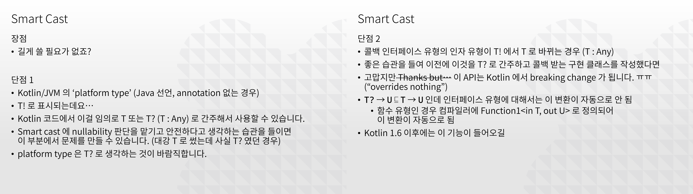

Trouble ID `2021-06-24.java-optional-and-kotlin-npe`

# Kotlin 에서 Java Optional 잘 쓰는 방법

f/u:

- [`2018-01-10.java-8-problematic-lambda-invokedynamic`](../2018-01-10.java-8-problematic-lambda-invokedyamic/)<br />Java 버전을 올리고 싶어요
- [`2020-01-25.moshi-kotlin-android-proguard`](../2020-01-15.moshi-kotlin-android-proguard/)<br />Moshi Kotlin & Android ProGuard (R8)

소스 코드에 람다 표현 문법, 바이트코드에 invokedynamic, 함수형 런타임 라이브러리. 그리고 이번에는 런타임 백포팅. Java 8 호환성 문제는 참 질리지도 않나 보다. 오늘은 `Optional` 이다. (이하 `Optional` 은 `java.util.Optional` 을 줄여 쓴 것이다.)

바보같게도 이런 느낌의 Kotlin 소스 코드를 쓰고 말았다.

```kotlin
val map = mutableMapOf<String, String>()
val optional = Optional.ofNullable<String>(null)
map["hello"] = optional.orElse(null)
```

이런 런타임 에러를 만나게 된다. 테스트 클래스로 만들어도 똑같은 결과가 나온다.

```
optional.orElse(null) must not be null
java.lang.NullPointerException: optional.orElse(null) must not be null
    at com.example.ExampleUnitTest.testFailsByKotlincNpe(ExampleUnitTest.kt:15)
    at ...
```

Kotlin 소스 코드는 이렇게 바꾸어야 한다.

```kotlin
val map = mutableMapOf<String, String>()
val optional = Optional.ofNullable<String>(null)
val s: String? = optional.orElse(null)
if (s == null) {
    map.remove("hello")
} else {
    map["hello"] = s //< smart cast
}
```

또는, Kotlin 스타일로 이런 함수를 하나쯤 만들어 둘 수 있다.

```kotlin
fun <T> Optional<T>.orElseNull(): T? = orElse(null)
```

이렇게 하면 반환 유형<sup>return type</sup>을 nullable 로 직접 명시할 필요가 없으므로, 아래와 같이 체이닝을 구성하는 데에 IDE 의 도움을 적절히 받아 null 문제를 빠뜨리지 않고 처리할 수 있다.

```kotlin
optional.orElseNull()
    ?.run { map["hello"] = this }
    ?: run { map.remove("hello") }
```

----

(Update @ May 2022)

언제나 그렇듯 잡설이 시작됩니다.

f/u:

- [`2020-06-25.reactivex-conversion-overview`](../2020-06-25.reactivex-conversion-overview/)<br />(내가 보려고 만든) ReactiveX 유형 변환
- [`2019-06-21.wow-much-generic-collection`](../2019-06-21.wow-much-generic-collection/)<br />와! 제네릭 컬렉션!

## 배경

Kotlin 이나 Optional 이나, 툴체인과 IDE 의 도움을 받아 NPE 를 피하는 도구인데 둘을 섞어서 쓰니까 조금 부주의했을 뿐인데 NPE 에 무방비로 노출된다는 건 정말 이해하기 어려운 일이다.

물론 그 속을 들여다 보면 다 그럴 만한 사정이 있다. `List` 나 `Map` 의 경우 Java 수준을 베이스라인으로 잡고 `MutableList` 와 `List`, `MutableMap` 과 `Map` 을 분리하는 정도에서 Kotlin 표준 라이브러리<sup>stdlib</sup>가 만들어졌다. `java.util.HashMap` 같은 것은 이 과정에서 `typealias` 로 들어왔다.

한편 `Optional` 은 Kotlin 이 해결하려고 하는 바로 그 부분에 대한 박싱<sup>boxing</sup> 접근이다. Kotlin 은 이 부분에서는 명확하게 `?.` 와 `?:` 연산자, 그리고 smart cast 라는 정답을 제시하고, 패키지에 `.kotlin_metadata` 파일을 포함하며 클래스파일에는 annotation 을 포함하여 이를 확산시키고 있다. 그렇다 보니, 그리고 사용자에게 여러 선택권을 주지 않는다는 Python 정신같은 것으로, `Optional` 은 Kotlin 표준 라이브러리에 들어오지 못한다. 그도 그럴 것이 Kotlin 표준 라이브러리에 들어오면 Kotlin/JVM 뿐만 아니라 Kotlin/Native, Kotlin/JS 에도 전파되게 되는데, 이쪽에는 `Optional` 을 사용할 이득이 전혀 없다. 따라서 `Optional` 이 표준 라이브러리에 들어오지 않는 게 그럴듯한 선택이 된다.

## 나의 실수 그리고 남탓

이제 내 고백과 변명을 하자면, `orElse(null)` 은 실제로 내가 쓴 바보같은 코드이다. 물론 Java 에서라면 그럴 수 있다. 정확히는 내가 Kotlin 에서 `MutableMap#put` 에 nullable 값을 넣으려고 한 게 실수였다.

이게 사실 Java 에서는 가끔 이게 어떤 키에 값이 있었다가 삭제된 경우를 표시하기 위해 쓰일 수 있는 방법이다. `kotlin.collection.HashMap` 의 `typealias` 인 `java.util.HashMap` 은 원래 여기에 적합한 null 키와 null 값을 허용하는 구현이다 \[1\]. 즉 저기에서 NPE 는 Kotlin 컴파일러가 `String!` 에서 `String?` 으로 묵시적 변환이 일어나는 위치에 삽입한 것이다 \[2\]. (ㅠㅠ 당연하지만 그게 아니면 `optional.orElse(null) must not be null` 같은 메시지가 나올 수가 없다.) 즉 엄밀히 말하면 `kotlin-stdlib-jdk8` 에서 `kotlin.collections.HashMap` 은 `java.util.HashMap` 과 완벽하게 동일하지는 않다. `java.util.HashMap<T, V>` 와 같은 효과를 내려면 `kotlin.collections.HashMap<T?, V?>` 를 명시해야 한다 \[3\]. 물론 이걸 바란 건 아니다.

그러나 내가 `kotlin.collections.HashMap` 을 Kotlin 스펙으로 생각하지 않고 `java.util.HashMap` 으로 생각해서 실수를 했다 한들, `orElse(null)` 은 대놓고 nullable 구문인데 컴파일이 안 되어야 하는 것 아닌가? 여기에서 상술한 Kotlin 내부 기술결정의 부작용이 발생한다. `Optional` 에 대해서는 다른 Java 런타임 라이브러리에 비해 Kotlin 표준 라이브러리의 서포트가 전혀 없기 때문에 `orElse(null)` 이라는 코드를 써도 반환 유형이 `T : Any` 인지 `T?` 인지 IDE 가 전혀 구분하지 못한다. 그냥 `T!` 일 뿐이다.

이런 혼동 때문에 내가 회사에서 사내 문서를 발행해서 동료들에게 Kotlin 코딩 컨벤션을 추천할 때 중요하게 넣었던 것 중 하나가, 플랫폼 유형<sup>platform type</sup> `T!` 는 항상 `T?` 로 간주하고 local `val` 을 만들어서 쓰자는 것이었다. (ㅠㅠ 그런데 바로 그걸 놓치는 실수를 했다.)



## 바라는 것

나는 Kotlin 표준 라이브러리에서 `Optional` 을 포함하지 않는 것은 그럭저럭 납득할 만한 기술결정이라고 생각한다. 그러나 `Optional` 을 쓰는 이 세상 코드 전체를 비토할 게 아니라면 적어도 `Optional` 에 대해 툴체인이 나쁘지 않은 지원을 제공해야 한다고 생각한다. `java.util` 에 있는 `Map` 이나 `List` 를 사용하기에는 mutability 통제가 되는 등 Kotlin 이 오히려 좋은 선택이 되는데, 같은 패키지에 있는 `Optional` 을 사용하는 순간 Kotlin 의 **null 안전성<sup>- safety</sup>**이라는 장점이 오히려 마비된다? 이건 납득하기 어렵다.

이 부분에 있어 가능한 대안을 하나 제안해 보자면, 아예 모든 `Optional<T : Any>` 에서 `T?` 로 자동 언박싱<sup>unboxing</sup>을 제공하는 기능이 추가될 수 있을 것이다. 허황된 이야기는 아닌 게, 예를 들어 툴체인은 기존 JSR-305 `@Nullable`/`@Nonnull` 을 포함해 알려진 모든 nullability 관련 annotation 을 인식하며 이 리스트는 계속 업데이트되고 있다 \[4\]\[5\]. 또한 Kotlin 의 박스드<sup>boxed</sup> 유형인 `Int` 는 표준 라이브러리에만 존재할 뿐 빌드 결과물에서는 플랫폼의 원시 유형<sup>primitive type</sup>으로 번역된다 \[6\]. Kotlin 외부 API 대상에 대해 nullability 관련하여 호환성을 적극적으로 맞춘 사례가 있으며, 언박싱 역시 사례가 있는 것이다. 아니면, 적어도 JVM 의 경우에 한정해서 `Optional` 의 메서드<sup>method</sup> 반환 유형이 `T : Any` 일지 `T?` 일지를 조금 더 명확하게 계산해 줄 수도 있을 것이다. 이 부분은 유형 추론<sup>type inference</sup>의 영역인데, 순방향<sup>forward flow</sup>으로 진행될 것이므로 `Optional` 메서드에 대한 추론 규칙을 추가하면 못 할 것도 없다.

한편 상기 annotation 들에 비하면 `Optional` 은 오히려 상당히 신뢰할 만한 구현에 속한다. 오히려 `Optional` 이 Kotlin 의 `T?` 에 비해 잘 되어 있는 부분이 있는데, Java 8 에 들어온 만큼 함수형 프로그래밍 용법에 적합한 메서드를 정의하고 있다는 것이다. 자, Haskell 에서 `Maybe a` 와 `List a` 모나드<sup>monad</sup>가 모범적으로 보여주듯, 값이 하나 존재할 수 있는 대상과 값이 여럿 존재할 수 있는 대상은 명확히 구분되지 않으며, 오히려 이들 간에 변환이 자유로운 체계가 프로그래밍에 적절한 자유를 부여한다. Scala 가 일찍이 `Option[+A]` 를 도입했으며 (`+` 는 공변<sup>covariant</sup>이라는 뜻이다) Haskell 의 `bind` 와 유사한 모나딕 개념인 `flatMap` 을 도입하여 `List[+A]` 뿐만 아니라 `Option[+A]` 에서도 동작하도록 하였다. (`List[+A]` 는 `Iterable` 이고 `Option[+A]` 는 `IterableOnce` 이다 \[6\].) 이를 받아들여 Java `Optional` 역시 `map`, `filter` 그리고 `flatMap` 과 같은 메서드 정의를 포함하고 하고 있다 \[7\].

물론 `?.` 체인이 모나딕하므로 `flatMap` 과 다를 바 없어 보인다만, 이게 `List` 와 함께 쓰이면 조금 성가시다. `kotlin.collection` 에는 확장함수인 `mapNotNull` 이나 `filterNotNull` 이 있으며 그 외에도 `mapIndexedNotNull`, `firstNotNullOf` 라든지 전역함수 `setOfNotNull`, `listOfNotNull` 같은 것이 정의되어 있는 등 너무 많은 `-NotNull` 중복이 있다. 그 와중에 `flatMapNotNull` 이나 `groupByNotNull` 같은 것은 누락되어 있으니, 마치 `flatMap` 이 없어 `map` 과 `flatten` 을 따로 해야 하는 것 같은 일이 생기고 이는 성능에 좋지 않은 영향을 준다.

한편 `List` 의 멤버에 대해서도 `operator get`, `first`, `last` 이 쓰이기 쉽게 만들어져 있는 편인데 이들의 반환 유형이 기본적으로 `T` 로 되어 있으니 부주의하게 사용했다가 `NoSuchElementException` 으로 제대로 교육받기 십상이다. `getOrNull`, `firstOrNull`, `lastOrNull` 을 써야 한다. `slice`, `subList` 역시 `IndexOutOfBoundsException` 을 던진다. 못 믿겠다면 테스트 코드를 돌려 보라.

```kotlin
listOf<Nothing>().slice(2..3).let(Any::toString).let(::println)
/* or */
listOf<Nothing>().subList(2, 3).let(Any::toString).let(::println)
```

이런 사실은 Kotlin 공식 문서에 (무엇을 기대하겠냐만) 제대로 나와 있지 않다. `List` 의 메서드 `get` 에 대해서는 설명이 누락되어 있고 \[8\] 그나마 모두의 확장함수인 `first` 에 대해서는 `NSEE` 발생을 명세해 두고 있다 \[9\]. 메서드인 `subList` 에 대해서도 설명이 누락된 건 마찬가지이며 모두의 확장함수인 `slice` 에 대해서조차 `IOOBE` 발생은 명세되어 있지 않다 (현 시점 기준).

안전한 방법은, 정통 함수형 언어에서 하듯 `take` 와 `drop` 을 사용해 리스트를 자르는 것이다 (성능에 좋은 방법은 아니다).

Kotlin 은 함수형 언어를 표방하고 선언부에서 `throws` 를 제거했으며 JVM 에서만 동작하는 `@Throws` annotation 을 남겨 두었다. 그러나 이는 단적으로 오히려 어떤 Kotlin 함수도 전함수<sup>full function</sup>가 될 것으로 적당히 믿고 넘어가면 안된다는 사실을 시사한다. 자, `operator get` 조차 안전하지 않다는 사실을 알 때 `getOrNull` 을 사용하는 것으로 충분하다고 생각할 수 있다. 물론, 현실 컴퓨터는 리스트 프로세싱<sup>list processing</sup>보다는 무작위 접근 기계<sup>random access machine</sup>에 가까우며; `a[n]` 이란 본질적으로 위험하니 `a.drop(n).take(1)` 을 사용해야 한다거나 하는 근본주의 주장을 펼 작정은 아니다. 핵심은, Kotlin 이 `Option[+A]` 같은 것을 도입하지 않고 `null` 을 그대로 사용함으로써 Scala 에 비해 적은 재추상화 비용으로 함수형 프로그래밍을 도입할 수 있다고 홍보한 부분이 사실은 함수형 프로그래밍에서 중요하게 여기는 부분을 전반적으로 누락함으로써 이루어졌다는 것이다. Kotlin 은 사실 null 안전성을 무시하고 일단 대강 사용할 수 있는 언어를 지향하며 그와 일관되는 설계로써 `operator get` 에 Java 의 예외를 그대로 노출했다. 그렇기에 그 정도 토대에서 안전성을 손수 구축해 나가는 과정은, 표준 라이브러리 API 전반에 `Option[+A]` 이 항상 전제되어 있는 Scala 에 비해, IDE 와 툴체인의 도움을 받지 못하고 결국 프로그래머가 많은 것에 직접 신경을 곤두세워야 하는 일이 될 것이다. 예측가능한 행동<sup>predictable behavior</sup>을 부여하기 위해서는 적절한 토대<sup>foundation</sup>가 필요하며 때로는 우리가 그것에 평소에 비용을 치르고 있어야 함을 인정할 필요가 있다.

Kotlin 은 앞으로도 플랫폼 유형을 `T!` 에서 `T?` 로 강제하는 방법을 공식 툴체인에서 제공할 계획이 없다 \[10\]. 그렇다면 언젠가 적어도 `Optional` 대응이 도입되는 건 필수적인 수순이 아닐까 기대해 본다.

----

(Update @ Jul 2022)

***What's new in 1.7*** <https://kotlinlang.org/docs/whatsnew17.html>

> **New experimental extension functions for Java Optionals**
>
> Kotlin 1.7.0 comes with new convenience functions that simplify working with `Optional` classes in Java. These new functions can be used to unwrap and convert optional objects on the JVM and help make working with Java APIs more concise.
>
> The `getOrNull()`, `getOrDefault()`, and `getOrElse()` extension functions allow you to get the value of an `Optional` if it's present. Otherwise, you get a default value, `null`, or a value returned by a function, respectively:

Kotlin 1.7 에 definitely non-nullable types 기능이 안정 수준으로 들어옴으로써 `Optional` 을 위한 `getOrDefault` 가 실험 수준에 추가되었다. 반환 유형은 `T & Any` 이다.

오늘의 결론: 뉴스 나오기 전에 생각이 많다면 가끔은 로드맵을 잘 보자. <https://kotlinlang.org/docs/roadmap.html>

----

(Update @ Jun 2023)

글이 좀 길고 주절주절 잡설이 많은데 문제의 핵심 실체가 뭐였는지 명확하지 않았고 언어 업데이트가 그걸 어떻게 풀게 해 주는지도 좀 대충 넘긴 것 같다. 지인의 피드백을 받아 아예 이 글의 네 번째 업데이트로써 나머지 전체를 간추린 버전을 다시 작성해 본다.

Kotlin `MutableMap` 의 제네릭 유형 변수가 해소된 `MutableMap<String, String>` 유형이 있다. 이 유형의 값을 `m` 이라 하자. 이것의 유형을 `MutableMap<String?, String?>` 으로 정했다면 `operator fun put` 은 안전했겠지만 `operator fun get ` 을 한 결과는 쓸데없이 `null` 을 제거하는 코드가 범람했을 것이다. Kotlin 유형 체계에서는 `null` 값이 `operator fun put` 으로 들어올 수 없도록 하는 것이 보다 편리하고, 다른 부분에서 `m` 값에 대해 `operator fun get` 을 사용하는 코드를 작성하는 동료들과의 협업에서 코딩 습관 문제에서 안전함을 추구하는 방법일 수 있다. 그래서 `m` 의 유형은 `MutableMap<String, String>` 으로 정한다. 여기까진 문제가 없다.

이제 외래 값 `a`, `b` 가 있다. `a` 는 여러 값들을 조합해 얻어 낸 Kotlin `Optional<String>` (Java `Optional`) 값이고 `b` 는 `a` 가 비어 있을 때에 쓰여야 하는 Kotlin `String?` 값이다. 이때 아래 코드는 정상 컴파일된다.

```kotlin
m["k"] = a.orElse(b)
```

사람 생각으로는 `a.orElse(b)` 의 유형은 `String?` 이다. 그러나 이걸 추론하는 규칙은 Kotlin 에 없다! Java `Optional<T>#orElse(T)` 의 반환 유형은 Java `T` 이고 Kotlin 컴파일러는 이를 플랫폼 유형 `T!` 으로 일괄 번역하기 때문이다. Kotlin 컴파일러는 이 부분에 `String!` 값을 `String` 으로 대입할 때 `null` 인 경우 소스 코드를 인용해 NPE 를 던지는 코드를 자동으로 삽입한다. 나는 테스팅 끝난 앱을 프로덕션에 내보내고 나서 외래 값의 변화로 어느날 갑자기 앱 크래시가 급증하는 것을 지켜봐야 했다.

Kotlin 1.8 에 안정 수준으로 들어온 Kotlin/JVM 의 `Optional` 확장함수 `getOrNull` 을 사용하면 위 코드는 다음과 같이 고쳐 쓸 수 있고, 아래 코드는 컴파일되지 않을 것이다.

```kotlin
m["k"] = a.getOrNull() ?: b
```

그러면 컴파일 오류를 보고 코드를 이렇게 바꾸어 쓸 수 있다.

```kotlin
val c = a.getOrNull() ?: b
if (c != null) {
    m["k"] = c
}
```

Kotlin 에서 null 안전성이 담보되는 방식은 이중적이다. Kotlin 소스 코드에 한정하면 `T?` 값은 절대 그냥 `T` 에 대입될 수 없고, 안전 접근 연산자 `?.` 를 사용하든 엘비스 연산자 `?:` 를 사용하든, NPE 를 던져 버리는 not-null 단정<sup>assertion</sup> 연산자 `!!` 를 사용하지 않도록 사람들을 유도할 수 있다. 그러나 Java 상호운용성<sup>interoperability</sup>을 지극히 강조하면서 퍼지고 있는 Kotlin/JVM 을 보자. Kotlin 소스 코드가 없는 플랫폼 유형 `T!` 에 대해서는 NPE 를 내는 것이 기본 동작이다. 이를 피하는 건 순전히 &lsquo;뇌지컬&rsquo;에 기대야 하는 일이며, 본문에 썼듯 `T!` 를 `T?` 로 보는 선택지는 없다.

Kotlin 내에서는 null 안전성을 강조하고, Java 라이브러리를 사용할 때에는 Java 코드에서 그랬듯 &lsquo;뇌지컬&rsquo;로 조심하지 않으면 null 안전성을 절대 얻을 수 없고. 게다가 `Optional` 을 포함하지 않기에 (지금도 Kotlin/JVM 에서 Java `Optional` 을 지원한 것 외에 Kotlin 의 `Optional` 은 없다), 하나만 있거나 비어 있을 수 있는 값을 컬렉션 연산에서 반복가능<sup>iterable</sup>하게 다룰 수도 없게 되고. 이 모든 기묘함은 Kotlin 언어 설계자들이 무능해서 세부사항을 빠뜨린 것이 아니라 오히려 어떤 원칙을 아주 일관적으로 따른 결과라는 사실을 생각해 보면 알 수 있다.

함수형 언어의 장점에 대한 권위를 Kotlin 이 충분히 가진 것처럼 끌어다 써서 좋아 보이게 하되, 그 중 어려운 부분을 만날 법한 실체를 빠뜨림으로써, 기존에 Java 를 사용하며 함수형 언어를 두려워하고 기피하던 일반 이용자들이 새로운 어법을 굳이 몰라도 되게 하여 당장 써 보기에도 지극히 편하게 하는 것.

우린 이것의 악의적인<sup>malicious</sup> 버전을 기만<sup>deception</sup> 내지는 우민화<sup>keeping people ignorant</sup>라고 부르기로 했다. IntelliJ IDEA 플랫폼의 기술 수준에 비하면 이 부분의 세부사항은 처참해 보이고, Kotlin 은 IDE 의 부속품에 불과한가 하는 생각에 짜증도 난다. 음, 물론 Java 만 열심히 쓰던 사람들의 경험과 마음이 지난 수 년 간 기존보다는 훨씬 함수형으로 작성된 코드들과 가까워지게 되었다는 결과는 무시할 수 없다. 그래서 나는 JetBrains 의 Kotlin 언어 개발자들이 충분히 선의<sup>good intention</sup>를 갖고 있다고 생각하며, 그들이 선의를 갖고 그에 기반해 행동하도록 앞으로도 응원해 주고 싶다. 하지만 그와 별개로 현실적인 타협선에서만 일하는 것은, 그게 특히 기술과 지식의 산물에 반지성주의가 섞인 아주 시장 친화적인 상품이라면, 기술을 아는 사람으로서 답답함을 느끼게 마련이다. 이런 현상은 웹사이트이나 모바일 앱뿐만 아니라 프로그래밍 언어라는 동종업계 기술자에게 팔리는 제품에서도 반복되는 편이다.

`Optional<T>#orElse(T)` 로 NPE 를 내는 컴파일 가능한 테스트 코드로 시작해서 Kotlin 에 대해 불만인 사실을 더 많이 구체적으로 늘어놓고 레퍼런스까지 달아 놓은 글을 보고 싶다면 이제 이 글을 처음부터 보면 된다.

----

\[1\] Oracle. *Java SE 8 API References.* Class HashMap\<K,V\> from package java.util. <https://docs.oracle.com/javase/8/docs/api/java/util/HashMap.html>

> Hash table based implementation of the `Map` interface. This implementation provides all of the optional map operations, and permits `null` values and the `null` key.

\[2\] JetBrains. Kotlin documents &mdash; *Compatibility guide for Kotlin,* section *Unify exceptions from null checks.* <https://kotlinlang.org/docs/compatibility-guide-14.html>

> Starting from Kotlin 1.4, all runtime null checks will throw a `java.lang.NullPointerException`

\[3\] Ibid. *Null safety,* section *Nullable types and non-null types.* <https://kotlinlang.org/docs/null-safety.html>

> Nullability issues with generic types being used for Java interoperation. For example, a piece of Java code might add `null` into a Kotlin `MutableList<String>`, therefore requiring a `MutableList<String?>` for working with it.

\[4\] Ibid. *Calling Java from Kotlin,* section *Nullability annotations.* <https://kotlinlang.org/docs/java-interop.html>

> Java types that have nullability annotations are represented not as platform types, but as actual nullable or non-null Kotlin types. The compiler supports several flavors of nullability annotations, including:
>
> - JetBrains (`@Nullable` and `@NotNull` from the `org.jetbrains.annotations` package)
> - JSpecify (`org.jspecify.nullness`)
> - Android (`com.android.annotations` and `android.support.annotations`)
> - JSR-305 (`javax.annotation`, more details below)
> - FindBugs (`edu.umd.cs.findbugs.annotations`)
> - Eclipse (`org.eclipse.jdt.annotation`)
> - Lombok (`lombok.NonNull`)
> - RxJava 3 (`io.reactivex.rxjava3.annotations`)

\[5\] JetBrains/kotlin (GitHub). Blob view, `master` branch, path `kotlin/core/compiler.common.jvm/src/org/jetbrains/kotlin/load/java/JvmAnnotationNames.kt`. <https://github.com/JetBrains/kotlin/blob/master/core/compiler.common.jvm/src/org/jetbrains/kotlin/load/java/JvmAnnotationNames.kt>

> ```kotlin
> val NULLABLE_ANNOTATIONS = listOf(
>     JvmAnnotationNames.JETBRAINS_NULLABLE_ANNOTATION,
>     FqName("androidx.annotation.Nullable"),
>     FqName("android.support.annotation.Nullable"),
>     FqName("android.annotation.Nullable"),
>     FqName("com.android.annotations.Nullable"),
>     FqName("org.eclipse.jdt.annotation.Nullable"),
>     FqName("org.checkerframework.checker.nullness.qual.Nullable"),
>     FqName("javax.annotation.Nullable"),
>     FqName("javax.annotation.CheckForNull"),
>     FqName("edu.umd.cs.findbugs.annotations.CheckForNull"),
>     FqName("edu.umd.cs.findbugs.annotations.Nullable"),
>     FqName("edu.umd.cs.findbugs.annotations.PossiblyNull"),
>     FqName("io.reactivex.annotations.Nullable"),
>     FqName("io.reactivex.rxjava3.annotations.Nullable")
> )
> ```

\[6\] Scala documents &mdash; *Conversion between Option and the Collections.* <https://docs.scala-lang.org/overviews/collections-2.13/conversion-between-option-and-the-collections.html>

> `Option` can be seen as a collection that has zero or exactly one element, and it provides a degree of interoperability with the collection types found in the package `scala.collection`. In particular, it implements the interface `IterableOnce`, which models the simplest form of collections: something that can be iterated over, at least once. However, `Option` does not implement the more comprehensive interface of `Iterable`. Indeed, we cannot provide a sensible implementation for the operation `fromSpecific`, which is supposed to create an `Option` from a collection of possibly more than one element. Starting from Scala 2.13, `Option` was made an `IterableOnce` but not an `Iterable`.

\[7\] \[1\] Oracle. *Java SE 8 API References.* Class Optional\<T\> from package java.util. <https://docs.oracle.com/javase/8/docs/api/java/util/Optional.html>

> **flatMap**
>
> ```
> public <U> Optional<U> flatMap(Function<? super T,Optional<U>> mapper)
> ```
>
> If a value is present, apply the provided `Optional`-bearing mapping function to it, return that result, otherwise return an empty `Optional`. This method is similar to `map(Function)`, but the provided mapper is one whose result is already an `Optional`, and if invoked, `flatMap` does not wrap it with an additional `Optional`.
>
> - **Type Parameters:**
>
>   `U` - The type parameter to the `Optional` returned by
>
> - **Parameters:**
>
>   `mapper` - a mapping function to apply to the value, if present the mapping function
>
> - **Returns:**
>
>   the result of applying an `Optional`-bearing mapping function to the value of this `Optional`, if a value is present, otherwise an empty `Optional`
>
> - **Throws:**
>
>   `NullPointerException` - if the mapping function is null or returns a null result

\[8\] JetBrains. Kotlin API Reference (latest) &mdash; kotlin-stdlib/kotlin.collections/List/get. <https://kotlinlang.org/api/latest/jvm/stdlib/kotlin.collections/-list/get.html>

> ```kotlin
> abstract operator fun get(index: Int): E
> ```
>
> Returns the element at the specified index in the list.

\[9\] Ibid. &mdash; kotlin-stdlib/kotlin.collections/first. <https://kotlinlang.org/api/latest/jvm/stdlib/kotlin.collections/first.html>

> ```kotlin
> fun <T> List<T>.first(): T
> ```
>
> Returns the first element.
>
> - **Exceptions**
>
>   `NoSuchElementException` - if the list is empty.

\[10\]. Kotlin discussion portal. *Forcing platform type to always nullable?* <https://discuss.kotlinlang.org/t/forcing-platform-type-to-always-nullable/3136>

> This talk by Andrey Breslav explains in detail why platform types are not, and are not going to be, always nullable: https://www.youtube.com/watch?v=2IhT8HACc2E
