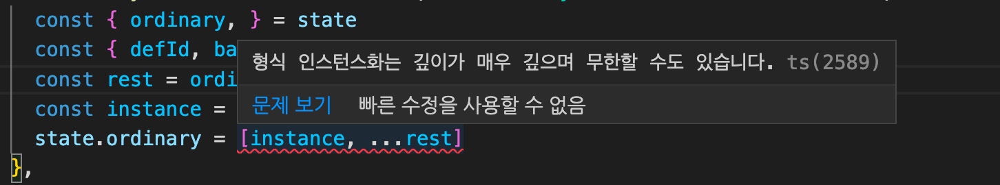
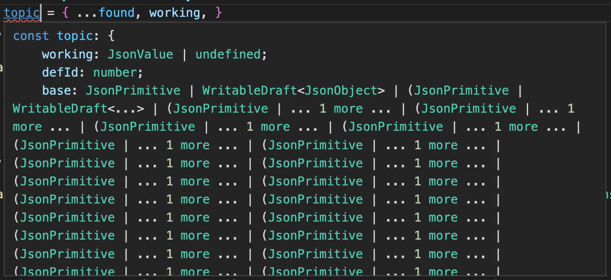

Trouble ID `2022-07-04.typescript-jsonvalue-typedef-no-more`

# TypeScript 에서 JsonValue 유형 정의하지 말기

TypeScript 를 쓰는 사람이라면 한번쯤 가끔은 이런 생각을 하게 되는 순간이 온다. 이게 적법한 JSON 에서 유래한 값인지에 대해 굳이 유형 명세로 한번 붙들어 매어 두고 싶다. 그게 구체적으로 어떻게 생겼을지는 코드를 작성한 사람에 따라 다르지만 나는 이렇게 썼다.

```typescript
type JsonValue = JsonPrimitive | JsonArray | JsonObject
type JsonPrimitive = null | boolean | number | string
type JsonArray = JsonValue[]
type JsonObject = { [_: string]: JsonValue, }
```

이걸&hellip; 특정 컴포넌트 안에서 제한적으로 사용하겠다면 말리지는 않겠다. 코드의 제어 흐름<sup>control flow</sup>이 유형 관점에서 빠짐없이 풀 커버리지로 작성되었다는 것을 굳이 검증받고 싶을 수 있다. 그러나 만약 이런 유형이 외부로 나간다면 끔찍한 결과를 얻을 수 있다. 하지 마라. 예를 들어 이걸 Redux 에서 사용하면 이렇게 되고 결국 `any` 를 사용해야 하게 된다.



TS2589: Type instantiation is excessively deep and possibly infinite.



무슨 일이 벌어진 걸까?

TypeScript 는 JavaScript 에 붙는 점진적 유형화<sup>gradual typing</sup> 도구이다 보니 기존과 같은 클래스 기반의 명목적 유형 체계<sup>nominal type system</sup>에 기대지 않고 순수 구조적<sup>structural</sup> 접근만 하도록 만들어졌다. 이 때문에 어떤 보조적 방법 없이 날것의 재귀적 유형<sup>recursive type</sup>을 사용하는 건 거의 자해에 가까운 일이 된다. 구조적 유형 체계에서는 설령 어떤 유형 식별자에 고정점<sup>fixpoint</sup>을 설정해 두더라도 이것이 유형 격자<sup>type lattice</sup> 도메인 내에서 고정점이 없는 다른 대상과 같은 유형인지를 계산하는 일이 필요하기 때문이다. 그런데 TypeScript 에서는 임의 유형 간의 합집합/차집합/교집합 연산이 정의되고 제네릭 유형이 있고 템플릿 리터럴 유형도 있다 ([typescriptlang.org](<https://www.typescriptlang.org/docs/handbook/2/template-literal-types.html>), [github.com](<https://github.com/microsoft/TypeScript/pull/40336>)). 제약이 없다면 TypeScript 의 유형 체계는 튜링 완전하게<sup>Turing complete</sup> 동작할 것으로 의심되고 있다. 여기에 제약을 거는 것이 TS2589 오류이며 TypeScript 는 일차 논리<sup>FOL</sup>를 푸는 대신에 모든 유형을 원시 유형으로 완결<sup>fully resolve</sup>하여 그 너비와 깊이가 일정 수준을 넘지 않을 것을 요구하고 있다. 너비 제한은 100,000 이다. 깊이 제한은 명시되어 있지 않다.

GitHub TypeScript 이슈 트래커에 일찍이 JSON 유형을 만들어 달라는 요청이 올라와 있다 ([github.com](<https://github.com/microsoft/TypeScript/issues/1897>)). Ryan Cavanaugh 는 모든 바보같은 요청에 정말 이골이 났을 법도 한데 친절하게 답변해 두고 아직도 이 이슈를 닫지 않고 있다.

- JSON 유형이 검증됨으로써 얻는 이점이 무엇일지 명확히 해 달라. 재귀적 유형을 사용할 뿐이라면 TypeScript 유형 체계에서 도움을 받기는 어렵다.
- `JSON.stringify` 라면 가능한 한 `Function` 을 조용히 무시하게 되어 있다. (`JSON.parse` 는 정상 값을 내놓을 것이다.)

`import` 로 JSON 파일을 가져온다거나, 외부에서 가져온 값이라면, 이 값을 유형 체계에 통과시키고  `is Foo` 같은 것을 작성해 값이 구체적인 유형 요구사항을 정상적으로 따르는지 그대로 체크하면 된다. 다만 `is Foo` 의 구현이 혹시라도, 예를 들어, `string` 이 아니지만 `string` 을 흉내내는 값을 `string` 으로 오판하지 않을지에 대한 막연한 불신이 있을 수 있다. 이에 대한 대답은, `string` 을 충분히 잘 흉내낸다면 그것이 `string` 이라는 것이다. 어차피 JSON 은 JavaScript 값 그 자체가 아니기 때문에 JavaScript 값에 같은 JSON 으로 가는 최소 표현<sup>minimal representation</sup> 같은 것이 존재하기를 바랄 수 없으며 JSON 에도 이런 가정이 불가능한 건 마찬가지이다. JSON 도메인은 JavaScript 런타임 모델과는 그냥 별건이다.

물론 솔직히 `JSON.parse` 와 `JSON.stringify` 의 유형 정의에 `any` 가 들어 있는 것이 불편하긴 하다. 그런데 이걸 어떻게 하는 게 좋다고 권장하기 어렵다. 차라리 그냥 `Exclude<unknown, undefined>` 써라. 이걸로 옮긴 값에 `Function` 이거나 `Symbol` 이거나 뭐 그런 게 들어 있다면, 오류를 남겨라. JavaScript 런타임에는 어차피 한계가 있고 `JsonValue` 같은 것에 검증받았다고 안심하기보다는 오류를 남기는 게 낫다.
