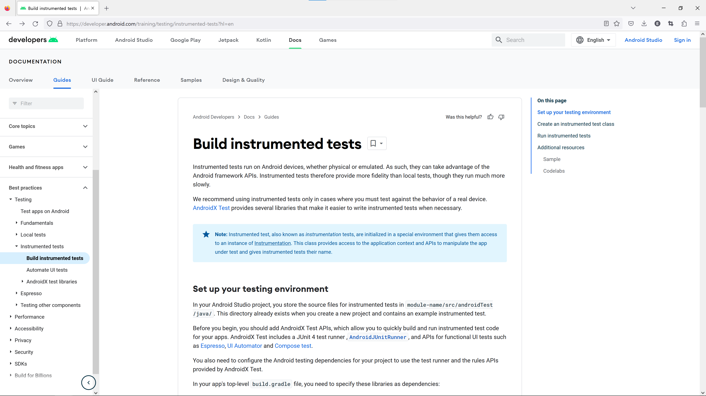
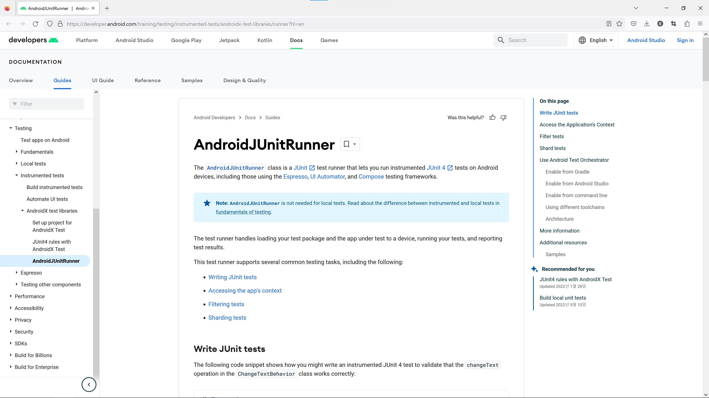
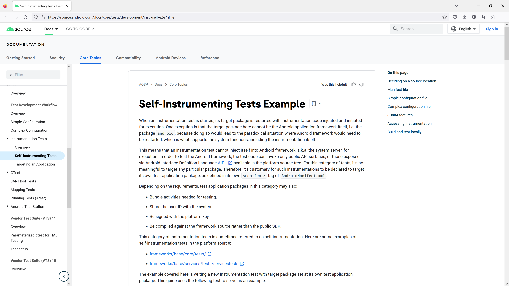
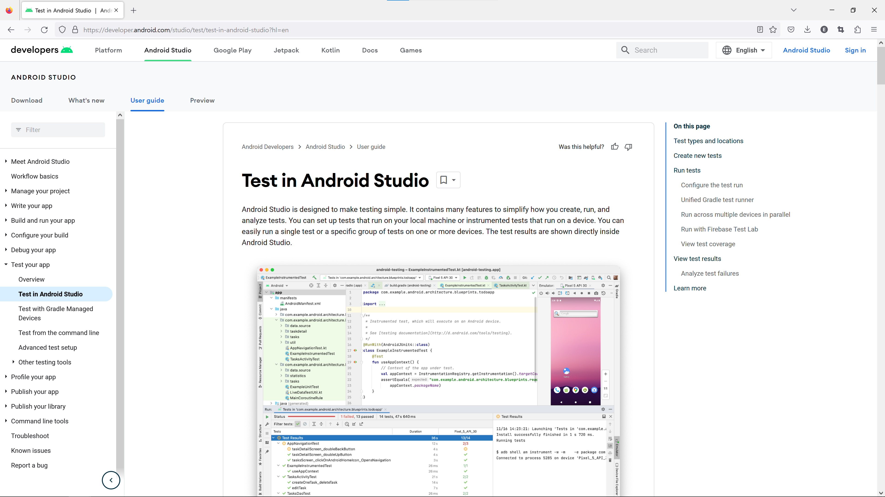
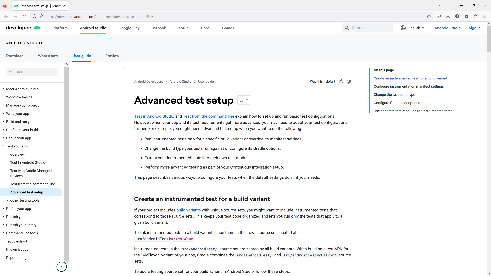
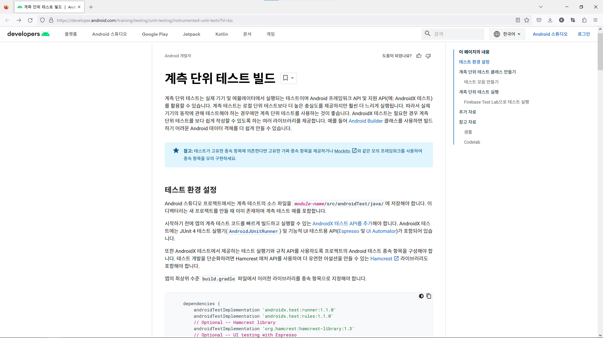

Trouble ID `2022-10-20.android-build-tools-test-coverage-file-generation`

# Android 빌드 도구의 시험 범위<sup>test coverage</sup> 파일 생성 기능

AGP (Android Gradle Plugin) 7.3 이 안정 채널로 릴리스 되었다.

> **7.3.0 (September 2022)**
>
> Android Gradle plugin 7.3.0 is a major release that includes a variety of new features and improvements.
>
> ----
>
> ~~<https://developer.android.com/studio/releases/gradle-plugin?hl=en#7-3-0>~~
>
> (Update @ May 2023)
>
> <https://developer.android.com/studio/past-releases/past-agp-releases/agp-7-3-0-release-notes?hl=en>

오늘의 주인공은 JaCoCo. <https://www.jacoco.org/jacoco/>

```kotlin
android {
    buildTypes {
        getByName("debug") {
            enableUnitTestCoverage = true
            enableAndroidTestCoverage = true
        }
    }
    testOptions {
        unitTests {
            isIncludeAndroidResources = true
        }
    }
    testCoverage {
        jacocoVersion = "0.8.8"
    }
}
```

```
./gradlew --no-daemon :app:testDebugUnitTest :app:createDebugUnitTestCoverageReport
./gradlew --no-daemon :app:connectedDebugAndroidTest :app:createDebugCoverageReport
```

`enableUnitTestCoverage`, `enableAndroidTestCoverage` 속성이 소개되었고, `isTestCoverageEnabled` 속성은 기피<sup>deprecate</sup>되었다. ([developer.android.com](<https://developer.android.com/reference/tools/gradle-api/7.3/com/android/build/api/dsl/BuildType#isTestCoverageEnabled()>))

----

f/u:

- [`2020-01-25.moshi-kotlin-android-proguard`](../2020-01-15.moshi-kotlin-android-proguard/)<br />Moshi Kotlin & Android ProGuard (R8)

JaCoCo는 Java 프로젝트에서 시험<sup>test</sup>의 코드 범위<sup>code coverage</sup>를 측정하기 위한 도구이다. 흔히 `jacoco.exec` 으로 언급되는 바이너리 포맷의 파일을 생산하고, 이로부터 HTML 이나 XML 로 된 리포트 파일을 만들어 주기도 한다. 전자는 JUnit 플랫폼과 사용 하는 경우 `java` 의 옵션인 `-javaagent` 로 `jacocoagent.jar` 를 지정해서 동작하고 \[1\], 후자는 단독으로 `java` 에 `-jar` 옵션으로 `jacococli.jar` 를 동작하게 되는데 \[2\], 솔직히 둘 다 웬만하면 직접 다룰 일은 없다. JaCoCo Maven 플러그인이나 JaCoCo Gradle 플러그인을 사용하기 때문이다. 이렇게.

> build.gradle.kts:
>
> ```kotlin
> plugins {
>     jacoco
> }
> ```
>
> build.gradle:
>
> ```groovy
> plugins {
>     id 'jacoco'
> }
> ```
>
> ---
>
> Gradle User Manual (“Gradle Docs,” current version). *The JaCoCo Plugin.* <https://docs.gradle.org/current/userguide/jacoco_plugin.html>

Android 역시 Gradle 프로젝트로 JaCoCo 플러그인을 그대로 그냥&hellip; 적용할 수 있으면 좋겠지만, 그게 될 리가 없지. 이 Android 앱/라이브러리 프로젝트라는 게 처음부터 표준 Java 프로젝트와는 처음부터 적잖이 달랐으니까. 그 모든 기묘한 부분을 Android SDK 의 build-tools 에 있는 빌드 툴체인에 다 몰아 넣어버린 것으로 Eclipse ADT 가 시작되어 AGP 로 이어져 왔다는 역사는 이제 그냥 사실로 받아들일 때가 됐다. AAPT (현행 AAPT2), Dx (현행 D8), apksigner (jarsigner에서 v1으로 출발; 현행 [APK Signature Scheme v4](<https://source.android.com/docs/security/features/apksigning/v4>)), 그리고 앞서 살펴봤던 ProGuard (현행 R8). 여기에 옛날부터 또 다른 중요한 내장 기능이 있었으니 이것이 바로 JaCoCo 이다. 즉 AGP 에 들어 있는 JaCoCo 를 사용하면 된다!

그런데 이게 관리가 안 된지 정말 오래됐다. 일단 JaCoCo 시험 리포트 파일을 생성할 수 있는 `createDebugCoverageReport` task 는 꾸준히 문제를 일으켰고 (AGP 1.3.1 릴리스 노트에는 이와 관련해 요즘엔 없었던 듯이 조용히 넘어갈 법한 버그 패치 사실이 기재되어 있다 \[3\],) AGP 4.2 부터는 아예 단위 시험<sup>unit test</sup>에 대해서는 `exec` 파일이 생성되지 않는 버그가 생긴 상태였다 \[4\]. 상황이 이렇다 보니 `create[ApplicationVariant]CoverageReport` task 가 계측 시험<sup>instrumented test</sup> \[5\] 범위 파일에만 관여하는 것은 그냥 존속하는 동작이 되어 버렸고, 이전부터 단위 시험에 대해서는 JaCoCo Gradle 플러그인을 이중으로 도입해서 HTML/XML 리포트를 생성한다거나, 심지어는 그냥 외래 JaCoCo 로 직접 단위 시험을 해 버리는 게 흔한 일이 되어 버렸다. 아래 나열한 글들을 보면 그냥 AGP 내장 JaCoCo 에 대해서는 언급조차 없이 외래 JaCoCo 를 사용하는 것이 얼마나 기본 전제가 되어 버렸는지 알 수 있다.


- (2016) <https://medium.com/@rafael_toledo/setting-up-an-unified-coverage-report-in-android-with-jacoco-robolectric-and-espresso-ffe239aaf3fa>
- (2016) <https://stackoverflow.com/questions/38249722/gradle-createdebugcoveragereport-doesnt-run-local-unit-tests>
- (2016) <https://stackoverflow.com/questions/40052876/android-getting-coverage-on-local-unit-tests>
- (2017) <https://android2ee.medium.com/playing-with-gradle-3-and-some-few-code-coverage-on-android-with-jacoco-47df7c9328ae>
- (2018) <https://stackoverflow.com/questions/48478927/jacocotestreport-task-not-being-generated>
- (2018) <https://medium.com/android-news/get-beautiful-coverage-reports-in-your-android-projects-ce9ba281507f>
- (2019) <https://snowdeer.github.io/android/2019/07/04/how-to-use-jacoco-plugin/>
- (2020) <https://mparchive.tistory.com/183>

감동적이게도 AGP 7.3.0 에 와서야 이 문제가 조금 교정된 것이다. `create[ApplicationVariant]CoverageReport` task 의 기존 동작은 그대로 두고, 계측 시험 범위 파일만 만들던 `isTestCoverageEnabled` 옵션을 제거하여 새 옵션으로 대체하며, `create[ApplicationVariant]UnitTestCoverageReport` task 를 추가한 것. 물론 이 사실은 잘 알려지지 않고 있다. 지금까지 홍보해 왔듯 Android Studio 가 얼마나 IDEA GUI 에 Android 앱/라이브러리 프로젝트의 시험과 범위 리포트 기능을 예쁘게 넣었는지가 그들에게 중요하지 않겠나.

자 그럼 이제 JaCoCo Gradle 플러그인은 제거하면 되나? 아직 조금 애매한 문제로 보일 수 있다. 적어도 단위 시험의 바이너리 `exec` 파일 생성과 HTML/XML 파일 생성은 정상화됐다. 그런데 항상 HTML 파일과 XML 파일을 동시에 생성하기 때문에, 만약 CSV 파일을 쓰고 있었다면, 혹은 HTML 파일을 만드는 시간을 아끼고 싶다면 `jacocoTestReport` task 를 완전히 대체할 수는 없다. 그리고 `jacocoTestCoverageVerification` task 의 기능은 AGP 에 없다. 이쪽은 본래 C0 이나 C1 같은 값이 균질하게 기준을 넘지 않으면 실패 처리되는 Gradle task 이다.

그런데 아마 웬만한 Android 앱/라이브러리 프로젝트에서는 불필요한 내용이 될 것 같다. Kotlin 을 사용하고 있을 테니 말이다. JaCoCo HTML 리포트 파일을 열어 보면 Kotlin 코드의 val, var 속성이 전부 JVM 클래스파일로 컴파일되어 Java 이름으로 바뀌어 있는 것을 알 수 있고, 이런 부분은 Kotlin 컴파일러가 생성하여 언어가 기본동작을 보장하는 범위인데도 시험 대상에 산입되어, val 속성의 획득자 `get()` 을 굳이 시험하지 않는다면 전부 시험 범위 지표를 깎아먹게 된다. 즉 `jacocoTestCoverageVerification` task 의 부재는 무의미하다.

아마 AGP 프로젝트에서 대단한 것을 해 주지 않는다면 이 부분에 대해서는 앞으로 SonarQube 를 이용하는 것이 상식이 될 것이다. SonarQube 는 시험 범위 결과 파일과 함께 Kotlin 소스 코드를 읽어서 Kotlin 언어 의미론에 맞게 시험 범위 지표를 계산해 준다. 최신 범위의 SonarQube 는 바이너리 포맷인 `exec` 파일을 지원하지 않고 XML 파일을 요구하는데, 이 부분에 대해서 굳이 HTML 파일을 생성하지 않고 시간을 절약한다면 `jacococli.jar` 를 이용할 수 있다. `jacocoTestReport` task 역시 굳이 남겨두지 않는 것을 추천한다. 상황이 이전보다는 희망적이고 JaCoCo 가 한 프로젝트의 빌드스크립트 클래스패스에 두 벌 있는 것은 별로 좋을 게 없다.

---

\[1\] JaCoCo Documentation: *Java Agent.*

> The agent `jacocoagent.jar` is part of the JaCoCo distribution and includes all required dependencies. A Java agent can be activated with the following JVM option:
>
> ```
> -javaagent:[yourpath/]jacocoagent.jar=[option1]=[value1],[option2]=[value2]
> ```
>
> ----
>
> JaCoCo Documentation, *Java Agent.* <https://www.jacoco.org/jacoco/trunk/doc/agent.html>

\[2\] JaCoCo Documentation: *Command Line Interface.*

> ```
> java -jar jacococli.jar report [<execfiles> ...] --classfiles <path> [--csv <file>] [--encoding <charset>] [--help] [--html <dir>] [--name <name>] [--quiet] [--sourcefiles <path>] [--tabwith <n>] [--xml <file>]
> ```
>
> Generate reports in different formats by reading exec and Java class files.
>
> ----
>
> Ibid, *Command Line Interface.* <https://www.jacoco.org/jacoco/trunk/doc/cli.html>

\[3\] Android Developers &mdash; Android Studio: What's new. *Android plugin for Gradle, revision 1.3.1 (August 2015).*

> - Maintained support for the `createDebugCoverageReport` build task.
>
> ----
>
> <https://developer.android.com/studio/past-releases/past-agp-releases/agp-1-3-1-release-notes>

\[4\] Google IssueTracker 195860510: *AGP 7.0.0 does not create unit test jacoco exec files correctly with testCoverageEnabled true.* <https://issuetracker.google.com/issues/195860510>

\[5\]: 계측 시험<sup>instrumented test</sup>이라는 용어 사용에 대하여.

계측 시험<sup>instrumented test</sup>의 다른 이름으로 계기 시험<sup>instrumentation test</sup>이 있다. Google 공식 문서에서 초기에 후자를 사용했는데, 요즘은 적어도 공식 용어는 전자로 통합되었다.

엄밀히 의미를 구분하자면 계기 시험보다는 계측 시험이 맞는 말이겠지만 (`Instrumentation`, `<instrumentation>` 을 사용하는 시험은 그 도구 자체를 시험하지 않고 실 기기 상에서 시험이 되도록 하는 기능에 기대는 것이므로,) 초기부터 혼동이 있었기 때문에, 번역이 마땅찮게 된 한국어에서뿐만 아니라 영어 화자들조차도 이를 충분히 구분하지 못하고 쓰는 중이다. 안타깝지만 보다시피 Google 공식 문서에서도 용어가 충분히 정리되지 못했다.

>**Instrumented tests** run on Android devices, whether physical or emulated. As such, they can take advantage of the Android framework APIs. Instrumented tests therefore provide more fidelity than local tests, though they run much more slowly.
>
>We recommend using **instrumented tests** only in cases where you must test against the behavior of a real device. AndroidX Test provides several libraries that make it easier to write **instrumented tests** when necessary.
>
>Note: **Instrumented test**, also known as **instrumentation tests**, are initialized in a special environment that gives them access to an instance of Instrumentation. This class provides access to the application context and APIs to manipulate the app under test and gives instrumented tests their name.
>
>\[&hellip;\]
>
>For more information about using **Instrumentation tests**, consult the following resources.
>
>----
>
>*(**emphasis** mine, original emphases/hyperlinks omitted)*
>
> Android Developers \[lang=en\] &mdash; Documentation: *Build instrumented tests.* <https://developer.android.com/training/testing/instrumented-tests?hl=en>
>
> 

> The `AndroidJUnitRunner` class is a JUnit test runner that lets you run **instrumented** JUnit 4 tests on Android devices, including those using the Espresso, UI Automator, and Compose testing frameworks.
>
> ----
>
> *(**emphasis** mine, original emphases/hyperlinks omitted)*
>
> Ibid: *AndroidJUnitRunner.* <https://developer.android.com/training/testing/instrumented-tests/androidx-test-libraries/runner?hl=en>
>
> 

> When an **instrumentation** test is started, its target package is restarted with instrumentation code injected and initiated for execution. One exception is that the target package here cannot be the Android application framework itself, i.e. the package `android`, because doing so would lead to the paradoxical situation where Android framework would need to be restarted, which is what supports the system functions, including the instrumentation itself.
>
> ----
>
> *(**emphasis** mine, original emphases/hyperlinks omitted)*
>
> Ibid: *Self-Instrumenting Tests Example.* <https://source.android.com/docs/core/tests/development/instr-self-e2e?hl=en>
>
> 

> Android Studio is designed to make testing simple. It contains many features to simplify how you create, run, and analyze tests. You can set up tests that run on your local machine or **instrumented** tests that run on a device. You can easily run a single test or a specific group of tests on one or more devices. The test results are shown directly inside Android Studio.
>
> \[&hellip;\]
>
> By default Android Studio Bumblebee uses Gradle to run its **instrumentation** tests. If you're experiencing issues, you can disable this behavior as follows:
>
> 1. Select File &gt; Settings &gt; Build, Execution, Deployment &gt; Testing (or Android Studio &gt; Preferences &gt; Build, Execution, Deployment &gt; Testing on MacOS.)
> 2. Uncheck the box next to Run Android instrumented tests using Gradle and click OK.
>
> ----
>
> *(**emphasis** mine, original emphases/hyperlinks omitted)*
>
> Android Studio \[lang=en\] &mdash; Android Studio: <https://developer.android.com/studio/test/test-in-android-studio?hl=en>
>
> 

> If your project includes build variants with unique source sets, you might want to include **instrumented** tests that correspond to those source sets. This keeps your test code organized and lets you run only the tests that apply to a given build variant.
>
> \[&hellip;\]
>
> The following table shows an example of how **instrumentation** test files could reside in source sets that correspond to the app's code source sets:
>
> ----
>
> *(**emphasis** mine, original emphases/hyperlinks omitted)*
>
> Ibid: *Advanced test setup.* <https://developer.android.com/studio/test/advanced-test-setup?hl=en>
>
> 

여기에서 더 TMI 를 발사하자면, 한때 용어가 계측 단위 시험<sup>instrumented unit test</sup>과 지역 단위 시험<sup>local unit test</sup>으로 구분되었기도 하다. 정리되지 않은 일부 한국어 문서에서는 아직 이 용어가 보이고 있다. 옛날 문서들에서는 지역 시험<sup>local test</sup>이라는 말을 볼 수 있는데 계기를 거치지 않는 일반 단위 시험을 의미하는 말이다.

> **계측 단위 테스트**는 실제 기기 및 에뮬레이터에서 실행되는 테스트이며 Android 프레임워크 API 및 지원 API(예: AndroidX 테스트)를 활용할 수 있습니다. **계측 테스트**는 **로컬 단위 테스트**보다 더 높은 충실도를 제공하지만 훨씬 더 느리게 실행됩니다. 따라서 실제 기기의 동작에 관해 테스트해야 하는 경우에만 계측 단위 테스트를 사용하는 것이 좋습니다. AndroidX 테스트는 필요한 경우 **계측 단위 테스트**를 보다 쉽게 작성할 수 있도록 하는 여러 라이브러리를 제공합니다. 예를 들어 Android Builder 클래스를 사용하면 빌드하기 어려운 Android 데이터 객체를 더 쉽게 만들 수 있습니다.
>
> ----
>
> *(**강조**는 인용에서 더하였고, 원문의 강조/하이퍼링크는 제거됨)*
>
> Android 개발자: *계측 단위 테스트 빌드.* <https://developer.android.com/training/testing/unit-testing/instrumented-unit-tests?hl=ko>
>
> 

어떤 사람은 여전히 이 용어 구분을 선호하며 Google 이슈트래커에서도 \[4\] 지역 시험을 언급하는 사람을 볼 수 있다.
