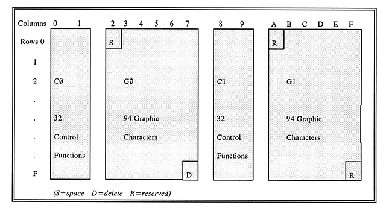
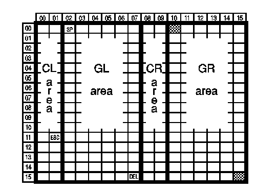
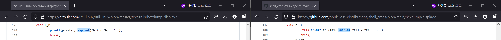
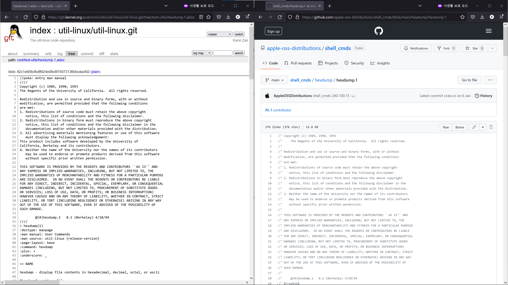

Trouble ID `2022-10-27.macos-hexdump-ascii-prints-gr`

# macOS 의 `hexdump -C` 가 GR 바이트를 그대로 출력하는 현상

> 스포일러: libc 주의, 잘못된 중간 결론 주의.

**`hexdump`** 라는 CLI 명령어가 있다. Linux 에서는 **util-linux** 라는 패키지에 들어 있는 구현인데, 파일의 내용을 십육진수와 바이트 단위로 나란히 보여 주는 ‘canonical’ 출력 형식으로 유명하다 ([*util-linux* in Wikipedia (en)](<https://en.wikipedia.org/wiki/Util-linux>), [*util-linux/util-linux* in GitHub](<https://github.com/util-linux/util-linux>)) \[1\].

```
$ echo hello | hexdump -C
00000000  68 65 6c 6c 6f 0a                                 |hello.|
00000006
```

나는 macOS Monterey 12.6 을 사용하는 중인데, 여기에도 `hexdump` 가 있다. 이쪽 구현은 FreeBSD 에서 대부분 가져온 **shell\_cmds** 라는 패키지에 들어 있다 ([*apple-oss-distributions/shell\_cmds* in GitHub](<https://github.com/apple-oss-distributions/shell_cmds>)). 이 명령어에도 ‘canonical’ 출력 형식이 들어 있다 \[2\]. 음&hellip; 근데 이 동작이 좀 다른 걸 발견했다. 바이트 단위 컬럼의 출력이 내가 쓰는 터미널 에뮬레이터에서 `�` 로 보이는 현상이 있는 것이다.

이게 정말 이상하다고 느꼈던 게, 내가 원래 쓰던 `hexdump -C` 는 SP 와 GL 캐릭터를 제외한 모든 코드포인트를 온점<sup>period</sup>으로 (`.`) 처리해 주기 때문이다.

우선 내 추측이 맞는지 검증하기 위해 U+AC00 과 U+AC20 을 각각 변환 시도했다 ([U+AC00 in compart.com](<https://www.compart.com/en/unicode/U+AC00>), [U+AC20 in compart.com](<https://www.compart.com/en/unicode/U+AC20>)). util-linux 쪽 `hexdump -C` 의 출력은 당연히 다음과 같다.

```
$ echo -ne '\xea\xb0\x80' | hexdump -C
00000000  ea b0 80                                          |...|
00000003
$ echo -ne '\xea\xb0\xa0' | hexdump -C
00000000  ea b0 a0                                          |...|
00000003
```

shell\_cmds 쪽 `hexdump -C` 의 출력은 다음과 같다.

```
% echo -ne '\xea\xb0\x80' | hexdump -C
00000000  ea b0 80                                          |�.|
00000003
% echo -ne '\xea\xb0\xa0' | hexdump -C
00000000  ea b0 a0                                          |갠|
00000003
```

ㅇㅋ. 이쪽의 `hexdump -C` 는 CL, CR 영역은 `.` 로 대체하지만 GL, GR 영역은 있는 그대로 출력한다.

이 동작을 깔끔하게 대체할 방법은 안 보인다. `hexdump -C` 가 바이트 단위로 출력하는 부분의 변환 문자열<sup>conversion string</sup>이 `%_p` 로 동일하기 때문이다. 조금 어색하더라도, 주로 Vim 의 최신 구현이라 OS 에 따라 대체될 일 없는 `xxd` 를 쓰는 것에 익숙해질 수 있을 것이다.

```
$ echo -e 'hello, world! foo\x00bar\x20baz\x80qux\xa0and so on.' | xxd
00000000: 6865 6c6c 6f2c 2077 6f72 6c64 2120 666f  hello, world! fo
00000010: 6f00 6261 7220 6261 7a80 7175 78a0 616e  o.bar baz.qux.an
00000020: 6420 736f 206f 6e2e 0a                   d so on..
```

**왜 이런 일이?** 이걸 이해하기 위해서는 GR 영역이 뭔지 알아야 한다. 아는 분은 아래 내용을 읽을 필요가 없다.

원래 1 바이트는 꼭 8 비트가 아니었던 혼돈의 시절이 있다. 지금이야 부호 집합<sup>code set</sup>에는 유니코드<sup>Unicode</sup>를 사용하고 UTF-8 로 부호화<sup>encoding</sup>하는 것이 상식이 되었다만, 대체로 아시겠다시피 그 이전에는 6 비트짜리 BCDIC 도 있었고 그게 8 비트로 발전한 EBCDIC 이라는 것도 있었다. 그 유명한 ASCII 는 이 경쟁에서 살아남은 표준으로, 대체로 8 비트 환경에서 쓰는 부호 집합으로 알려진 것과 달리 원래는 7 비트용 부호 집합이다. 미국 국가표준협회<sup>ANSI</sup>가 (미국 국립표준기술원<sup>NIST</sup>과는 무관한 사설단체임) 만든 이 표준은 고난 끝에 EBCDIC 을 제치고 옥텟<sup>octet</sup>의 시대를 지배하게 된다.

그러나 8 비트의 시대에 7 비트짜리 표준이 준수된다는 것은 절반의 공간을 쓰지 않고 버린다는 뜻이기에, 실상 그것이 미래의 표준을 위한 토양이 되어 버렸으며 표준의 실질로써는 유명무실해졌음을 시사한다. 실제로 확장<sup>Extended</sup> ASCII 등등의 이름으로 여러 부호 집합이 등장했으며 기존 7 비트 ASCII 영역까지도 변형해 사용하는 일이 아주 흔히 벌어진다. 우리에게 `C:₩` 로 익숙한, 백슬래시 `\` 대신 원화 기호 `₩` 를 표시하는 부호 집합 역시 ASCII 의 변형이다. 이들은 나중에 [ISO/IEC 646](<https://en.wikipedia.org/wiki/ISO/IEC_646>) KR 이라는 이름으로 국제 표준에 등재된다.

나머지 절반의 공간은 어떻게 되었을까? 이 부분 역시 ANSI 에서 발행한 ASCII 의 부속 표준을 따르는 편이다 (표준 번호도 X3.4 의 부속 표준이라 X3.41 이라고 붙었다). 8 비트 평면을 양분해서, 왼쪽에 있는 ASCII 의 제어 문자<sup>control character</sup>와 도형 문자<sup>graphic caracter</sup>는 각각 CL, GL 이라고 부르고, 그 오른쪽도 제어 문자와 도형 문자로 나눠서 각각 CR, GR 이라고 부른다. GR 영역의 2 바이트로 부호 하나를 부호화한다. 이것이 흔히 알려진 94&times;94 문자 집합이고 [EUC<sup>Extended Unix Code</sup>](<https://en.wikipedia.org/wiki/Extended_Unix_Code>) 라고도 부르는 방법이다. 미국 의회도서관 규격인 MARC-21 이나, ISO/IEC JTC 1 의 전신인 CEN/TC304 의 문건을 보면 이 부분을 쉽게 이해시켜 주는 그림을 만날 수 있다.

> 
>
> Retrieved from <https://www.loc.gov/marc/specifications/speccharmarc8.html>.

> 
> 
> Retrieved from <https://www.open-std.org/cen/tc304/guidecharactersets/guideannexa.html>.

JTC 1 에서 [ISO/IEC 2022](<https://en.wikipedia.org/wiki/ISO/IEC_2022>) 나 [ISO/IEC 8859](<https://en.wikipedia.org/wiki/ISO/IEC_8859>) 등을 발행한 것은 나중 일이다. 예를 들어 MARC-21 에서 94&times;94 문자 집합을 EUC 로 부호화한 다국어 데이터 여럿을 병합해서 위해 SI/SO 같은 테크닉을 사용한 것이 ISO/IEC 2022 로 다시 발행되었고, 미국과 서유럽에서 가장 많이 사용하는 1 바이트짜리 확장 ASCII 부호면<sup>code page</sup>이 [ISO/IEC 8859-1](<https://en.wikipedia.org/wiki/ISO/IEC_8859-1>) 이 된 것이다. 오랜 세월이 지나 실용적인 영역에서 SI/SO 테크닉은 사멸했다는 판정을 받고, 유니코드를 처음 구성한 기본 다국어 평면<sup>BMP; basic multilingual plane</sup>에서는 ISO 8859-1 을 따라 [Basic Latin](<https://en.wikipedia.org/wiki/Basic_Latin_(Unicode_block)>) 다음에 [Latin-1 Supplement](<https://en.wikipedia.org/wiki/Latin-1_Supplement>) 를 배치하게 된다.

`hexdump -C` 에서 GR 영역 바이트가 왜 그대로 출력되는지에 대한 답으로, **이쯤 되면 기술결정의 이력을 이해할 수 있게 된다.** 유니코드는 1991 년에 만들어졌고, 한동안 유니코드의 문자 집합인 범용 부호화 문자 집합<sup>UCS; Universal Coded Character Set</sup>은 2 바이트짜리로 여겨졌으며, UCS-2 가 사멸하여 UTF-16 의 합리적인 대체재로 ASCII 와 호환되는 UTF-8 이 자리잡기 전까지는, 시스템 기본 부호면은 ISO/IEC 8859-1 로 간주되는 것이 일반적이었다 (한국어의 경우 MS CP949).

FreeBSD `hexdump` 가 `%_p` 처리에서 인쇄가능 문자<sup>printable character</sup>로 (도형 문자의 다른 이름) GL 뿐만 아니라 GR 까지 포함했기 때문이다. 이는 지극히 ISO/IEC 8859 기반의 자기중심적인 발상이다. 터미널이 ISO/IEC 8859-1 출력을 지원하고 바이트 스트림이 같은 ISO/IEC 8859-1 로 부호화되어 있다면 이는 GR 부호점에 대해서도 문제 없이 작동한다. 그리고 어쩌면 EUC 에 대해서도, GL 을 싱글 바이트로 쓰고 남은 GR+GR 을 쓰는 94&times;94 문자 집합은 대부분 전각 문자를 정의했기 때문에 터미널이 이를 출력해 줄 수도 있다; 운이 나쁘지 않다면. 바이트 스트림 상에서 GR+GR 바이트 쌍이 2 바이트 단위에 정렬되어 있지 않은 채로 16 바이트 줄을 넘어간다면, 운이 나쁘게도 94&times;94 문자 집합은 터미널에서 알맞게 출력될 수 없다. 또한 GR+GR (G1) 외에 CR 등을 사용하는, MS CP932 나 MS CP949 같은 경우는 당연히 도메인에서 배제된다. 이런 부분에서까지 동작을 교정하려면 `hexdump` 를 새로 써야 한다.

물론 그럴 필요 없다. 유니코드와 UTF-8 이 상식인 시대가 되었다. 부호점<sup>codepoint</sup> 하나가 4 바이트로 부호화되기도 하고, 어떤 부호점이 터미널 에뮬레이터에서 몇 칸에 걸쳐 출력될지에 대해서는&hellip; 솔직히 아무도 미리 알 수 없다. 물론 유니코드로 된 파일이라면 일부 올바른 출력을 얻을 수도 있겠지만 이 역시 운이 따라 줘야 한다. U+0100 그리고 U+0120 처럼.

```
% echo -ne '\xc4\x80' | hexdump -C
00000000  c4 80                                             |�.|
00000002
% echo -ne '\xc4\xa0' | hexdump -C
00000000  c4 a0                                             |Ġ|
00000002
% cat <(head -c15 /dev/zero) <(echo -ne '\xc4\xa0') | hexdump -C
00000000  00 00 00 00 00 00 00 00  00 00 00 00 00 00 00 c4  |...............�|
00000010  a0                                                |�|
00000011
```

**이제 진짜 답을 찾을 시간이다.** 사실 `hexdump -C` 가 GR 영역 바이트를 `.` 로 출력하게 하는 방법이 있다. hexdump(1) man page 는 `-C` 옵션을 `Canonical hex+ASCII display` 라고 설명하고 있다. `a0-ff` 는 ASCII 도형 문자가 아니니, GR 바이트를 그대로 출력하는 것은 이에 의하면 오동작이다. 그러나 변환 문자열 `%_p` 의 설명은 이렇게 되어 있다.

> `_p` Output characters in the default character set. Non-printing characters are displayed as a single '.'.

이는 명세에 의해 util-linux 쪽과 shell\_cmds 쪽 모두의 `hexdump` 가 `-C` 내부의 `%_p` 처리에 isprint(3) ([*isprint(3)* in linux.die.net](<https://linux.die.net/man/3/isprint>), [*isprint(3)* in freebsd.org](<https://www.freebsd.org/cgi/man.cgi?query=isprint&sektion=3&manpath=freebsd-release-ports>)) 구현에 의존하도록 한다. 각 `char` 값이 인쇄가능 문자인지는 통합적인 결과이기 때문이다. 이 사실은 Linux 와 macOS 에서 내가 겪은 동작의 차이가 각각 util-linux 와 shell\_cmds 의 `hexdump` 구현에서 유래하는 문제가 아니라 플랫폼 libc 의 `isprint()` 동작을 진짜 원인으로 하고 있었음을 확인해 준다.



플랫폼 libc 와 OS 의 기본동작을 교정하는 것은 대단히 위험하고 복잡하고 힘든 문제이지만, 기존 libc 가 동작을 일정하게 달리하도록 유도할 수는 있다. macOS 터미널에서 다음과 같이 `hexdump -C` 를 실행한다. 동작은 상기한 Linux 기반 OS 에서와 비슷하다.

```
LANG=C LC_ALL=C hexdump -C
```

Linux 기반 OS 터미널에서는 다음과 같이 `hexdump -C` 를 실행해 볼 수 있다. 상기한 macOS 에서와 비슷한 동작을 한다.

```
LANG=en_US.ISO8859-1 LC_ALL=en_US.ISO8859-1 hexdump -C
```

보이는 결과는 (구체적으로 `�` 라든지) 터미널 에뮬레이터에 따라 다르다. 내가 macOS 에서 쓰는 터미널 에뮬레이터는 iTerm 2 이다. 기본 터미널 앱을 사용한 사람의 사례가 하나 있다. Apple Support Communities: Mac OS X 10.5 Snow Leopard. *hexdump -C outputs unreadable characters.* <https://discussions.apple.com/thread/1547562>

`hexdump` 구현은 사실 shell\_cmds 에 있는 것뿐만 아니라 util-linux 에 있는 것도 FreeBSD 에서 가져온 것이다. 한편 상기한 Vim 은 ex mode 에서 `:set isprint=` 를 지원하는 것과 별개로 `xxd` 가 각종 isprint 디테일에 덜 의존하게 만들어져 있다. 끝.



----

\[1\] hexdump(1) man page. from util-linux. Copyright (c) Free Software Foundation, Inc. Licensed (hexdump) under BSD 4-Clause UC.

> ```
> HEXDUMP(1)                       User Commands                      HEXDUMP(1)
> 
> NAME
>        hexdump  -  display  file  contents  in hexadecimal, decimal, octal, or
>        ascii
> 
> SYNOPSIS
>        hexdump [options] file...
> 
> DESCRIPTION
>        The hexdump utility is a filter which displays the specified files,  or
>        standard input if no files are specified, in a user-specified format.
> 
> OPTIONS
>        Below,  the  length  and offset arguments may be followed by the multi‐
>        plicative suffixes KiB (=1024), MiB (=1024*1024), and so  on  for  GiB,
>        TiB,  PiB,  EiB,  ZiB  and YiB (the "iB" is optional, e.g., "K" has the
>        same meaning as "KiB"), or the suffixes KB  (=1000),  MB  (=1000*1000),
>        and so on for GB, TB, PB, EB, ZB and YB.
> 
>        -b, --one-byte-octal
>               One-byte  octal  display.  Display the input offset in hexadeci‐
>               mal, followed by sixteen  space-separated,  three-column,  zero-
>               filled bytes of input data, in octal, per line.
> 
>        -c, --one-byte-char
>               One-byte  character  display.  Display the input offset in hexa‐
>               decimal,  followed  by  sixteen  space-separated,  three-column,
>               space-filled characters of input data per line.
> 
>        -C, --canonical
>               Canonical  hex+ASCII display.  Display the input offset in hexa‐
>               decimal, followed by sixteen space-separated, two-column,  hexa‐
>               decimal  bytes, followed by the same sixteen bytes in %_p format
>               enclosed in '|' characters.
> 
>        -d, --two-bytes-decimal
>               Two-byte decimal display.  Display the input offset in hexadeci‐
>               mal,  followed  by  eight  space-separated,  five-column,  zero-
>               filled, two-byte units of input data, in unsigned  decimal,  per
>               line.
> 
> [ ... omitted ]
> 
> STANDARDS
>        The  hexdump utility is expected to be IEEE Std 1003.2 ("POSIX.2") com‐
>        patible.
> 
> AVAILABILITY
>        The hexdump command is part of the util-linux package and is  available
>        from Linux Kernel Archive ⟨https://www.kernel.org/pub/linux/utils/util-
>        linux/⟩.
> 
> util-linux                        April 2013                        HEXDUMP(1)
> ```

\[2\] hexdump(1) man page. from shell\_cmds. Copyright (c) Apple Inc. Licensed under BSD 3-Clause.

> ```
> HEXDUMP(1)                   General Commands Manual                  HEXDUMP(1)
> 
> NAME
>      hexdump – ASCII, decimal, hexadecimal, octal dump
> 
> SYNOPSIS
>      hexdump [-bcCdovx] [-e format_string] [-f format_file] [-n length]
>              [-s offset] file ...
> 
> DESCRIPTION
>      The hexdump utility is a filter which displays the specified files, or the
>      standard input, if no files are specified, in a user specified format.
> 
>      The options are as follows:
> 
>      -b      One-byte octal display.  Display the input offset in hexadecimal,
>              followed by sixteen space-separated, three column, zero-filled,
>              bytes of input data, in octal, per line.
> 
>      -c      One-byte character display.  Display the input offset in
>              hexadecimal, followed by sixteen space-separated, three column,
>              space-filled, characters of input data per line.
> 
>      -C      Canonical hex+ASCII display.  Display the input offset in
>              hexadecimal, followed by sixteen space-separated, two column,
>              hexadecimal bytes, followed by the same sixteen bytes in %_p format
>              enclosed in ``|'' characters.
> 
>      -d      Two-byte decimal display.  Display the input offset in hexadecimal,
>              followed by eight space-separated, five column, zero-filled, two-
>              byte units of input data, in unsigned decimal, per line.
> 
> [ ... omitted ]
> 
> SEE ALSO
>      od(1)
> 
> macOS 12.6                        June 29, 2020                       macOS 12.6
> ```
