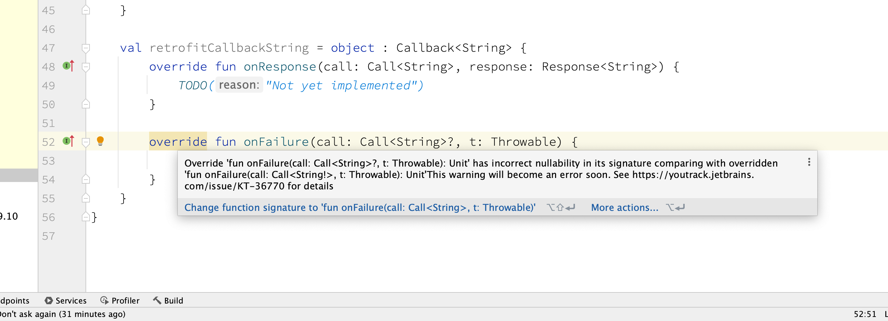

Trouble ID `2023-09-06.kotlin19-retrofit2x-callback-nullability`

# Retrofit 2.x Callback 구현과 Kotlin 1.9 nullability 처리 변경



Kotlin 1.9 를 도입하면서 Retrofit 2.x 코드에서 발견한 Kotlin 컴파일러 경고. 요컨대 `?` 를 없애면 되는 건데, `!` 가 버젓이 있는데 이게 무슨 소리야 싶은 게, 하나는 Retrofit 소스코드는 변함없이 이렇게 생겼기 때문이다. ([retrofit2/Callback.java @ 2.9.0](<https://github.com/square/retrofit/blob/2.9.0/retrofit/src/main/java/retrofit2/Callback.java>))

```java
public interface Callback<T> {
  void onResponse(Call<T> call, Response<T> response);
  void onFailure(Call<T> call, Throwable t);
}
```

그리고 다른 하나는 &mdash; 하&hellip; &mdash; 밑에서 긴 글로 이 원인을 풀도록 하겠다. 결론부터 얘기하면, 이 유형은 not nullable 하게 정의되어 있는 것이 맞다. JSR-305 는 웬만큼 알고 있다고 생각했는데, package-info 에 not nullable 정보를 지정할 수 있더라. ([retrofit2/package-info.java @ 2.9.0](<https://github.com/square/retrofit/blob/2.9.0/retrofit/src/main/java/retrofit2/package-info.java>))

```java
@retrofit2.internal.EverythingIsNonNull
package retrofit2;
```

`EverythingIsNonNull` 은 JSR-305 의 `ParametersAreNonnullByDefault` 같은 것인데, `ParametersAreNonnullByDefault` 는 `Nonnull` 로 지정되어 패키지나 클래스, 중첩 클래스 등에도 쓰일 수 있도록 이렇게 정의되어 있다. (주석<sup>comment</sup> 생략)

```java
package javax.annotation;

import java.lang.annotation.Documented;
import java.lang.annotation.ElementType;
import java.lang.annotation.Retention;
import java.lang.annotation.RetentionPolicy;

import javax.annotation.meta.TypeQualifierDefault;

@Documented
@Nonnull
@TypeQualifierDefault(ElementType.PARAMETER)
@Retention(RetentionPolicy.RUNTIME)
public @interface ParametersAreNonnullByDefault {
}
```

`EverythingIsNonNull` 은 이 정의를 확장하고 있다. ([retrofit2/internal/EverythingIsNonNull.java @ 2.9.0](<https://github.com/square/retrofit/blob/2.9.0/retrofit/src/main/java/retrofit2/internal/EverythingIsNonNull.java>))

```java
package retrofit2.internal;

import java.lang.annotation.Documented;
import java.lang.annotation.ElementType;
import java.lang.annotation.Retention;
import java.lang.annotation.RetentionPolicy;
import javax.annotation.Nonnull;
import javax.annotation.meta.TypeQualifierDefault;

@Documented
@Nonnull
@TypeQualifierDefault({ElementType.FIELD, ElementType.METHOD, ElementType.PARAMETER})
@Retention(RetentionPolicy.RUNTIME)
public @interface EverythingIsNonNull {}
```

Kotlin 컴파일러는 `ParametersAreNonnullByDefault` 를 다루고 있는 한편 \[1\], `ParametersAreNonnullByDefault` 와 유사하게 정의된 주해<sup>annotation</sup>들이 잘 작동하도록 하고 있다 (출처 생략). 하나 짚고 넘어가자면, 스크린샷을 보면 추론된 유형이 `Call<String!>` 이라고 되어 있지, `Call<String!>!` 이라고 되어 있지 않다. 즉 `Call` 에선 몰라도 `Callback` 에서는 인자 유형이 not nullable 로 확인되었다는 뜻이다. 그럼에도 불구하고 저 자리의 유형을 `Call<String>?` 으로 하여금 `Callback` 의 구현을 작성할 수 있다는 건, 여러 맥락 상, 컴파일러가 조만간 오류로 처리하여야 할 상황이 맞다. 끝.

----

긴 글.

Java 에서, 상위 구현이나 인터페이스를 기각하는<sup>overriding</sup> 하위 구현이, 메소드의 인자 유형<sup>argument type</sup>을 상위 유형의 것과 달리할 수 없다는 사실은 비교적 투명하고 자명하다. 그런데 이는 사실 OOP 개념 자체보다는 JVM 의 제약에 의한 현상인데, 하위 유형이 허용하는 연산이 상위 유형의 같은 연산에 비해, 만약 더 제약된 하위 유형의 인자를 받도록 좁아지는<sup>narrowing</sup> 조작을 가한다면 그것은 이론적으로 리스코프 치환 원칙<sup>LSP; Liskov substitution principle</sup>을 보장하고자 하는 근본 전제를 부정하는 것이 되지만, 오히려 덜 제약된 상위 유형의 인자를 받도록 넓어지는<sup>widening</sup> 조작을 가한다면 사실 이론적으로 문제 될 부분은 없기 때문이다. 그러나 JVM 은 인스턴스에 대해 메소드를 호출할 때 다음과 같은 방식을 따르는데, (물론 `invokevirtual` 인 경우 더 구체적으로는 옵코드<sup>opcode</sup> `0xb6` 와, 상수 웅덩이<sup>constant pool</sup>를 참조하는 인덱스로 2 바이트를 사용하며, `invokeinterface` 나 `invokespecial` 은 규칙이 조금씩 다르지만,)

```
invokevirtual com/example/Super.foo:([Ljava/lang/String;)V
```

이때 피연산자 스택<sup>operand stack</sup>에서 두 개의 참조<sup>reference</sup> 값을 사용하고, 처음 뽑은 값이 리시버<sup>receiver</sup>가 된다 (두번째 뽑은 값은 `String[]` 유형의 인자일 것이다). 이때 해야 할 일은 리시버의 유형이 소스코드에서 추정한 대로 `com.example.Super` 의 하위 유형이 맞는지&hellip; 리시버로부터 상위 클래스로 따라가며 점검하고, 어떤 클래스에서 `void foo(String[] a)` 라는 구현을 (`Super` 자신이 아닌 하위 유형이고 `Super.foo` 가 `abstract` 가 아니라면, `Super.foo` 를 기각하는 구현을) 만나면 비로소 그것을 실행하는 것이다. (상위 인터페이스의 기본<sup>default</sup> 구현 이야기 따위는 싹 생략했다.) 자, 여기에 추가되는 요구사항으로, 이제 만약 `invokevirtual` 연산에서 받은 메서드 설명자<sup>descriptor</sup>의 인자 유형이 실제로 실행해야 할 메서드 구현의 인자 유형에 비해 좁아도 된다고 (그리고 반환 유형은 &mdash; 넓어도 된다고) 가정해 보자. 그럼 이제 JVM 은 리시버의 유형으로부터 상위 유형으로 이동하며 `foo` 라는 이름을 가진 모든 메서드에 대해 인자 유형의 (그리고 반환 유형의) 상속 관계를 (또는, 그 내지는 동등함을) 점검해야 하게 된다. 아 끔찍해라;;;

음, 사실 이게 이젠 이미 `invokedynamic` 을 만났을 때 JVM 이 항상 하고 있는 일이고, `invoke` 에 비해서 좀 효율적인 `invokeExact` 를 만들어 둔 이유이기도 하다. 구체적으로 알고 싶으면, Java SE 7 과 Java SE 8 의 Chapter 6 를 대조해 읽어 보면 된다는 사실 정도는; 굳이 언급하지 않아도 되리라고 생각한다만; 한번 남겨 둔다.

- <https://docs.oracle.com/javase/specs/jvms/se7/html/jvms-6.html>
- <https://docs.oracle.com/javase/specs/jvms/se8/html/jvms-6.html>

뭘 위해 이렇게 사족이 길었냐면 이번에도 Kotlin 이다. 아무튼 Java 는 상위 유형에서 정의한 메서드는 그것을 기각하는 하위 유형의 구현에서 인자 유형을 넓히지도 못하게 하고 있는데, Kotlin 은 여기에 한 술 더 떠서 nullability 도 추가하지 못하게 하고 있다. 예를 들어 Java 에 이런 인터페이스가 있다고 해 보자.

```java
public interface Foo {
    void foo(@NotNull String[] a);
}
```

그러면 Kotlin 에서는 이런 구현을 만들 수 없다.

```kotlin
class Bar : Foo {
    fun foo(a: Array<String>?)
}
```

나는 이런 현실적 제약에 항상 불만이 좀 많긴 하지만, 대체로 그 결정의 배경이 아예 전혀 이해 되지 않는 일은 없는 편이다. 다만, Java 에서 `@NotNull` 같은 것이 없었다면 Kotlin 에서는 nullable 로 가정하는 것이 유형 안전 관점에서는 더없이 괜찮은 습관인데, 어떤 Java 라이브러리에서 버전 업데이트에 따라 `@NotNull` 같은 제약을 추가해 주면 Java 기준으로는 non-breaking 이더라도 Kotlin 기준으로는 breaking 변경이 되어 버린다는 점 등에서 버전 관리가 좀 불편해지는 감이 잖아 있다. (`Optional` 얘기할 때 첨부한 슬라이드에서 이 부분은 언급된 바 있다.)

아무튼 Kotlin 은 이 부분에서 Java 와 같은 원칙 하에, 더욱 엄격함을 유지하여 왔다. 제네릭 유형 인자에서 바로 이 구멍난 부분 빼고. Kotlin 1.9 호환성 가이드에는 이 이슈가 호환성을 깨는 이슈로 언급되어 있다.

> <big>Prohibit unsound calls with expected @NotNull T and given Kotlin generic parameter with nullable bound</big>
>
> **Issue**: [KT-36770](https://youtrack.jetbrains.com/issue/KT-36770)
>
> **Component**: Kotlin/JVM
>
> **Incompatible change type**: source
>
> **Short summary**: Kotlin 1.9 will prohibit method calls where a value of a potentially nullable generic type is passed for a `@NotNull`-annotated parameter of a Java method.
>
> **Deprecation cycle**:
>
> - 1.5.20: report a warning when an unconstrained generic type parameter is passed where a non-nullable type is expected
>
> - 1.9.0: report a type mismatch error instead of the warning above,
>   `-XXLanguage:-ProhibitUsingNullableTypeParameterAgainstNotNullAnnotated` can be used to temporarily revert to the pre-1.8 behavior
>
> ----
>
> Kotlin Docs: *Compatibility guide for Kotlin 1.9.* <https://kotlinlang.org/docs/compatibility-guide-19.html#prohibit-unsound-calls-with-expected-notnull-t-and-given-kotlin-generic-parameter-with-nullable-bound>

이게 앞서 언급한, IDEA 메시지에서도 언급된 KT-36770 이다. 실제로 이 이슈를 직접 읽어 보자면 정말 더없이 난해하다. Java 유형에서 제네릭 유형 인자를 not nullable 하게 정한 경우, 그 유형의 인자로, nullable 한 Kotlin 제네릭 유형 인자의 값을 넣을 수 있다는&hellip; 꽤나 어이없는 유형 안전성 버그를 설명하고 있는데, 본문을 발췌해 보자.

> <big>Code example</big>
>
> ```kotlin
> // FILE: SLRUMap.java
> 
> import org.jetbrains.annotations.NotNull;
> import java.util.List;
> 
> public interface SLRUMap<V> {
>  void takeV(@NotNull V value);
>  <E> void takeE(@NotNull E value);
> 
>  void takeVList(@NotNull List<@NotNull V> value);
>  <E> void takeEList(@NotNull List<@NotNull E> value);
> }
> 
> // FILE: main.kt
> 
> fun <E> SLRUMap<E>.getOrPut(value: E, l: List<E>) {
>  takeV(value) // No error, but E is nullable while expected type is not
>  takeVList(l) // No error, but given list elements are nullable while in expected type List elements are not nullable
>  takeE(value) // No error, but E is nullable while expected type is not
>  takeEList(l) // No error, but given list elements are nullable while in expected type List elements are not nullable
> }
> ```
>
> <big>What's wrong with it</big>
>
> Currently, that code is compiled successfully without any warnings while implementation clearly expects it's not null.
> Also, there might be runtime checks on the entrance of the method automatically generated by intellij instrumenter.
>
> Besides that, the behavior is not consistent with a case when an argument for `takeV` is not a Kotlin generic parameter
>
> ```kotlin
> fun SLRUMap<String?>.getOrPutString(value: String?, l: List<String?>) {
>  takeV(value) // TYPE_MISMATCH error
>  takeVList(l) // TYPE_MISMATCH error
> 
>  takeE(value) // TYPE_MISMATCH error
>  takeEList(l) // TYPE_MISMATCH error
> }
> ```
>
> These cases (`getOrPut` and `getOrPutString`) should obviously work consistently because the contents of the latter one might be simply replaced with a call `this.getOrPut(value, l)` that is safe & sound, while the definition `getOrPut` is not.
>
> ----
>
> JetBrains YouTrack: Kotlin (KT) &mdash; *Prohibit unsafe calls with expected @NotNull T and given Kotlin generic parameter with nullable bound.* <https://youtrack.jetbrains.com/issue/KT-36770>; copyright theirs.

우와 도대체 이게 무슨 말이야; 그러니까 &ldquo;No error&rdquo; 라고 되어 있는 소스 코드가 사실은 잘못된 것이고 &ldquo;TYPE\_MISMATCH error&rdquo; 라고 되어 있는 코드가 컴파일러가 정상 동작하는 경우인데, 이슈에서 설명하기로는 이를 &ldquo;저 코드가 성공적으로 컴파일되는<sup>that code is compiled successfully</sup>&rdquo; 전자의 경우가 있고, 후자의 경우를 아울러 보면 &ldquo;일관성을 잃는 동작을 하며<sup>the behavior is not consistent with</sup>&rdquo; 요컨대, 이 경우들이 &ldquo;일관성 있게 동작해야 하는데<sup>should obviously work consistently</sup>&rdquo; 그 이유를 `getOrPutString` 을 `getOrPut` 으로 안전하고 건전하게 대체할 법하지만 `getOrPut` 의 정의는 그렇지 않기 때문이란다. 뭐???

나는 아무 대책 없이 IDEA 를 통해 이 이슈를 제일 먼저 만났고, 물론 `?` 를 없애고 경고가 사라지는 걸 보고 납득하면 될 일이었지만, 오류에 비해 경고는 착오 신호<sup>false signal</sup>일 수 있다는 점에서 원인을 알아보고자 했으나&hellip; &ldquo;이것도 처리 안 해 줄 거면 저것도 하지 마라&rdquo; 식의 어감으로 논리가 궤변 비슷하게 쓰인 글을 만나서 수 개월을 허비하고 만다. 진짜 끝.

결론: 없다.

아니, 특별한 건 없고, 항상 이게 답이었지만, 자연어를 읽고 혼란스러우면 당황해 주저앉지 말고 차라리 코드를 샅샅이 뒤져 보기나 하자. 진짜 진짜 끝.

----

\[1\] JetBrains/kotlin (GitHub). Blob view, `master` branch, path `kotlin/core/compiler.common.jvm/src/org/jetbrains/kotlin/load/java/AnnotationQualifiersFqNames.kt`. <https://github.com/JetBrains/kotlin/blob/master/core/compiler.common.jvm/src/org/jetbrains/kotlin/load/java/AnnotationQualifiersFqNames.kt>

> ```kotlin
> val BUILT_IN_TYPE_QUALIFIER_DEFAULT_ANNOTATIONS = mapOf(
>     FqName("javax.annotation.ParametersAreNullableByDefault") to
>             JavaDefaultQualifiers(
>                 NullabilityQualifierWithMigrationStatus(NullabilityQualifier.NULLABLE),
>                 listOf(AnnotationQualifierApplicabilityType.VALUE_PARAMETER)
>             ),
>     FqName("javax.annotation.ParametersAreNonnullByDefault") to
>             JavaDefaultQualifiers(
>                 NullabilityQualifierWithMigrationStatus(NullabilityQualifier.NOT_NULL),
>                 listOf(AnnotationQualifierApplicabilityType.VALUE_PARAMETER)
>             )
> ) + JSPECIFY_DEFAULT_ANNOTATIONS
> ```

