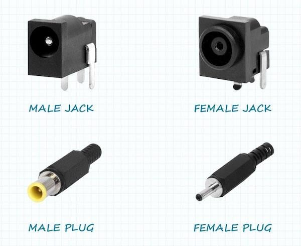
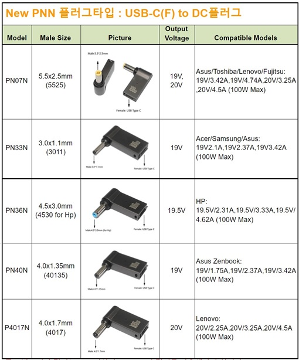
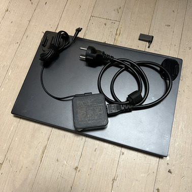
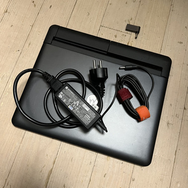
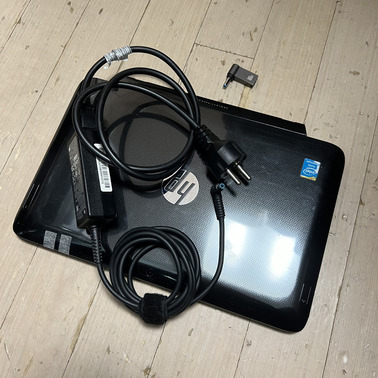
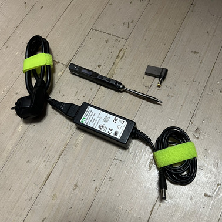

Trouble ID `2023-10-07.usb-pps-to-barrel-jack-smps`

# USB-C PPS 를 배럴barrel SMPS 로 사용하기

USB PD (Power Delivery) 가 완벽하게 우리 생활 속으로 보급되면서 이제는 PD 충전을 지원하지 않는 노트북은 찾아보기 어렵게 되었다. Microsoft Surface 나 Apple MacBook 같은 선구자는 이 흐름에 오히려 역행하는 모습을 간혹 보이기도 하는데&hellip; 이에 대한 이야기는 글의 뒤쪽으로 미루고.

가장 아쉬운 것은 기존에 쓰던 (랩탑 컴퓨터) 노트북들을 USB PD 생태계 안으로 들여 오기가 너무 어렵다는 사실일 것이다. PD 기반으로 최대 20V 5A (100 W) 프로파일 충방전을 지원하는 배터리가 대중화되어 너무나 다양한 선택지를 제공하고 있는데, 지금 쓰는 구시대 제품은 그 혜택을 입을 수 없다면? USB PD 전원 어댑터와 노트북 전원 어댑터를 동시에 들고 다녀야 한다면? 물론 그게 정말 중요한 가치라면 아예 새 노트북을 장만해도 되겠다만&hellip; 다행히도 이 구시대 노트북들을 USB PD 생태계로 편입시킬 수 있는 방법이 있으니, 선택지로써 이런 것 하나쯤 갖고 있으면 정말 괜찮지 않겠나?

보통 노트북 전원 어댑터는 배럴 커넥터를 사용한다. 수학적으로는 원기둥(circular) cylinder에 근사되는 외형을 가진 것들이 사람들이 전통적으로 원통형이었던 술통의 이름을 따서 배럴이라고 부르며, 미국에서 쓰이는 부피 단위에도 이 배럴이라는 이름이 붙어 있다.

> &shy;
>
> All About Circuits (allaboutcircuits.com) &mdash; Industry Articles. Ryan Smoot, CUI Devices. [*How to Select DC Power Connectors: The Basics.*](<https://www.allaboutcircuits.com/industry-articles/how-to-select-dc-power-connectors-the-basics/>) Copyright theirs.

이 배경지식을 기반으로 배럴 커넥터는 다음 기준으로 고르면 동등한 것을 고를 수 있음을 알 수 있다.

- 핀이 플러그와 잭/리셉터클 중 어느 쪽에 있는지.

  전통적으로 전기 커넥터는 필요한 도선 수만큼의 접촉점을 갖고 각 접촉점은 핀pin과 그에 대응하는 핀 소켓&ndash; socket으로 이루어져 있다. 핀이 있는 쪽이 수컷male이고 핀 소켓이 있는 쪽이 암컷female이다. 이는 플러그와 잭/리셉터클 분류와는 구분되는데, 장치와 케이블을 접속하는 규격에서 고정된 장치 쪽에 있도록 설계된 것을 잭jack 또는 리셉터클receptacle이라고 하고 이동하는 케이블 쪽에 있도록 설계된 것을 플러그plug라고 하기 때문이다.

  배럴 커넥터는 플러그와 잭/리셉터클로 이루어져 있고 웬만하면 접촉점은 두 개뿐이다. 첫 번째 접촉점은 플러그의 원통형 바깥면이고 다른 하나는 핀이다. 이 구성에서 플러그가 수컷이고 잭이 암컷일 수도 있으나, 반대로 플러그가 암컷이고 잭이 수컷일 수도 있다.

- 외경 (바깥지름) outer diameter, major &ndash;. 플러그의 원통 지름. 잭/리셉터클의 외경은 허용오차를 두고 이 값보다 크다.

- 내경 (안지름) inner diameter, minor &ndash;. 핀의 지름. 핀은 전통적으로 원통형이다. 플러그의 원통 구조체 내경이 아니다.

- 플러그의 길이와 핀의 길이는 충분할 것으로 가정한다. 길이가 영향을 주는 경우는 없다고 보아도 좋다.

- 여기에 더해서, 직류 전원 규격이므로, 정격 전압과 전류의 방향. 중심의 핀이 양극(+)인지 음극(-)인지에 따라 중심양극center positive와 중심음극center negative로 구분한다.

- 가장 대중적인 규격은 5525 배럴 커넥터라고 한다. 5525 는 외경 5.5 mm &times; 내경 2.5 mm 이고 플러그가 암컷이다. 전압은 3.3, 5, 9, 12 등으로 워낙 다양한데 방향은 대체로 중심양극을 쓴다.

이제 우리 관심사로 돌아가 보자. USB PD 는 USB-C 커넥터의 CC 핀을 통해 PDO/APDO 메시지를 교환하여 전압과 전류를 조정받는 시스템이기 때문에, 정격전압과 최대전력을 알맞게 맞춰 주는 기능이 있고 이 결과를 배럴 커넥터로 공급한다면 노트북 전원 어댑터의 좋은 대체재가 될 것이다! 여기에서 노트북 제품마다 다른 전압과 전력 그리고 배럴 커넥터 규격을 전부 알고 구비해 뒀다 조합해야 한다는 문제가 생기는데. 당연하게도 이 문제를 미리 해결해 둔 기성품이 꾸준히 나오고 있다. (아 뭐야;)

> &shy;
>
> Eddy Lab. [*구형노트북에 USB-C 충전을 할 수 있다 !!!   New PNN 시리즈 : USB-C PD(F) to DC플러그 제품이 출시되었습니다. (Update 210812) + 100W 초고속충전케이블 USB-C 맥세이프 자석어댑터 (추가내용).*](<https://muritzy.tistory.com/2786>) ([blog.naver.com](<https://blog.naver.com/carrier00/222058456881>)) Copyright theirs.

위 이미지는 어떤 온라인 쇼핑몰에서 취급하는 USB PD &ndash; 배럴 직류전원 어댑터 제품 카탈로그를 일부 가져온 것이다. 전부 USB PD 측에서는 20V(max) 5Amax 규격을 사용하며, 이를 토대로 배럴 커넥터를 사용하는 다음 4 가지 전자제품에 USB PD 로 전원 공급을 하는 구성을 해낼 수 있었다 (크기 순 목록).

- 4.0 &times; 1.35 female plug 19V
  - &shy;
  - ASUS Vivobook S433F
  - ASUS ADP-65GD D 19V 3.42A 65W LPS
- 4.0 &times; 1.7 female plug 20V
  - &shy;
  - Motorola Laptop Dock ASMM860LDOCK-KR2A
  - Motorola SPN5639B 19V 1.58A 30W LPS
- 4.5 &times; 3.0 male plug 19.5V
  - &shy;
  - HP Pavillion x2 11-h106tu
  - HP HSTNN-DA40 19.5V 2.31A 45W LPS
- 5.5 &times; 2.5 female plug 20V
  - &shy;
  - Seeed Studio Mini Soldering Iron Shape-BC2 24Vmax 65Wmax
  - DYS DYS404-190210V 19.0V 2.1A 40W SMPS

이렇게 끝. 당연하게도 공급 측의 정격 전력이 소비 전력보다 항상 높으니 동작은 아주 안정적이다. 이렇게 되면 당장 상위 모델로 업그레이드하지 않고도 누릴 수 있는 좋은 점이 많다. 일단 노트북을 두 개 들고 다녀도 어댑터 무게로 고생할 일이 없다. 예전에 비하면 물론 노트북들 자체도 가벼워졌지만 어댑터 무게는 무시할 수 없는 부분이었으니까. 그리고 그 무게로 USB-C 100 W 파워뱅크를 갖고 다녀서 노트북에도 내가 원하는 수준의 외장 보조배터리를 연결할 수 있다.

그럼에도 불구하고 이 구성을 남들에게 추천하기 어려운 이유가 있다.

----

**서론.** 대체로 우리가 관심을 갖고 있는 시스템은, 이미 자연 현상인 것들보다는, 에너지를 투입하여 그 비용cost보다 결과로 얻어지는 편익benefit을 크게 할 수 있는 것들이거나, 그에 필요한 에너지 자체를 자연으로부터 얻어내는 도구들이다. 이런 관점에서 무엇을 동작시키든 동력원power source은 중대한 이슈이다. 동력원이 전기electricity인 경우 이를 전력원electrical power source, 줄여서 전원이라고 하고, 이를 에너지의 수요처가 되는 시스템에 적절히 연결하는 것을 전력 공급&ndash; power supply, 그 단위를 전원부 내지는 전원 장치PSU; &hellip; unit라고 하며, 전력을 전송하는 것을 송전&ndash; power transmission이라고 한다.

교류AC; alternating current와 직류DC; direct current의 구분도 다루어 볼 법하다. 여러 이유에서 건축물의 수전반/배전반/분전반까지 도달하는 수준의 송전은 교류로 이루어지고, 따라서 많은 전기 제품이 편의상 교류를 있는 그대로 사용한다. 교류 전원은 기본적으로 사인파sine wave로 이루어져 있을 것으로 간주되며 고유의 전압과 주파수(진동수)frequency를 특성값으로 갖는다. 그러므로 우리가 교류 전원을 보는 시각은 파동을 기초 주파수fundamental &ndash;와 그 정수배의 선형결합으로 보는 푸리에 해석Fourier analysis에 기반하고 있다. 푸리에 해석을 따르는 각 항의 주파수 성분을 고조파harmonics라고 하는데, 원칙상 기초 진동수 성분 역시 고조파에 포함되는 것이 정의이나 현실적으로 &lsquo;고조파&rsquo;라고 불리는 것은 기초 진동수 외의 성분을 지칭하는 경우가 많다 (비슷한 예로 &lsquo;가속도&rsquo;가 현실적으로 무슨 의미로 쓰이는지 생각해 보자). 따라서 교류 전원에서 기초 주파수 사인파를 벗어나는 노이즈는 전부 고조파로 지칭하고, 고조파 제거는 주파수 도메인에서 행해지는 아주 명확한 작업이 된다.

직류는 이상적인 조건에서 전원이 나머지 회로의 양단에 대해 전위차electric potential difference를 일정하게 유지해 줄 것을 가정한다. 이상적인 직류 전원에서 회로는 일정한 전압을 받아 일정한 전류를 흘려 전력을 소모할 것이다. 그러나 현실적으로 직류 전력을 공급하기 위해서는 정류기rectifier 회로가 사용되고, 이 과정에서 정류 회로의 고유한 특성과 교류 전원의 고조파 노이즈 등이 남아, 직류 전원에서도 전압에 노이즈가 발생하게 된다. 이는 고조파가 아니라 리플(출렁임)ripple이라고 한다. 리플의 영향은 일반적으로 직류 회로를 설계하는 기초 원리에는 전혀 포함되지 않으나, 현실적으로 보면, 전압의 변화는 국소적으로 교류와 비슷하게 기능하기 때문에, 회로의 RLC 성분에 따라 노이즈의 위상phase이 바뀌고 전류가 바뀌며, 전파radio 관점에서는 회로의 물리적인 일부분이 안테나antenna처럼 거동하게 하는 등, 아주 골치를 썩이게 만드는 말썽쟁이가 따로 없다.

전자 회로는 특성상 필수적으로 직류를 사용하는 경우가 대부분이므로, 전원 장치와 전원부가 직류 전원을 다루는 직류 제품에는 바로 이 리플을 제거하는 기능이 포함되어 있고, 시판 교류 USB-C 전원 어댑터가 광고하는 &ldquo;GaN&rdquo;도 바로 이 리플 노이즈를 제거하는 회로에 쓰이는 캐패시터(축전기)capacitor 소자 부품의 소재 물질 중 하나이다. 적절한 곳에서 리플 노이즈가 제거되지 않는다면 노트북은 전원의 품질 때문에 무선 인터넷 기능이 마비된다거나 LCD 화면이 손상된다거나, 램이나 SSD 에서 정보 손실이 (= 복구 불가한 신호 왜곡이) 일어나는 확률이 높아지는 일을 겪을 수 있다.

그렇다, 그럼 이제 더 중요한 사실들로 들어가 보자. **본론.** 고조파와 리플은 전원에서 버려져야 할 성분이며, 최종적으로는 저항으로 태워 없애야 한다. 전원에서 이들을 제거하고 유효 성분을 얻기 위해 필요한 비용의 수준은 전원의 품질을 결정한다. 전원부가 회로의 전압과 전류를 감당하여 정격 공급할 수 있는지는 너무나도 기본적인 수준의 문제인 것이다. 핵심은 전원의 품질이다.

USB PD 2.0 과 PD 3.0 을 구분해서 부를 때 PDOpower data object 와 PPSprogrammable power supply 라고 하는 경우가 더러 있다. 조금만 더 소스를 뒤져 보면 더없이 정확히 알 수 있다. USB PD 는 USB C 커넥터의 CC 핀을 통해 디지털 통신을 하고, 이로써 전력의 수요처에서 전원부에 전압과 전류를 협의negotiate할 수 있도록 한 규격이다 (USB A, B 커넥터를 쓰던 과거 USB PD 1.0 과는 단절된 부분만 다룬다). 이 규격에서 통신 프로토콜 부분에 쓰이는 것이 USB PD 2.0 의 PDO 와 PD 3.0 의 APDOaugmented PDO 이다.

그럼 PPS 는? 전압과 전류를 조정할 수 있는 전원 장치를 PPS 라고 한다. PD 3.0 APDO 의 경우 전압까지도 연속적으로 컨트롤할 수 있는 규격이라 하여 PPS 라고 부르기도 하는 것인데, 따지고 보면 USB PD 라는 규격 자체가 소프트웨어적인 PPS 규격인 셈이다. PPS 는 전류, 소모 전력, 전원 장치 자신의 컨디션 등을 측정하여 정격 전압과 전류를 제공할 수 있도록 구성되어 있다&hellip; 다만 대관절 어떻게 전압을 변경시킨다는 말인가?

바로 SMPSswitching mode &ndash; 기술 기반이다. 이 SMPS 는 직류 전원으로부터 교류 전원을 만드는 인버터(반전기)inverter와도 비슷하게, 직류 전원을 아주 높은 주파수로 껐다 켜는 것을 반복하여 (그리고 축전기를 거쳐) 목표 전압을 만들어 낸다. 당연하게도 이 과정에서는 리플 노이즈가 무지막지하게 많이 발생하고, 실험실 수준에서 쓰는 SMPS 장치는 전원 품질 문제에 대해 아주 관심이 많다. 그럼 비용이 올라가는 게 인지상정. 그럼에도 불구하고 쓰이는 SMPS 의 장점은 벅부스트 컨버터buck boost converter를 구현할 수 있다는 데에 있다.

SMPS 없이 단순히 교류를 직류로 변환한다고 생각했을 때, 목표 전압은 교류 전원의 Vrms 를 절대 넘지 못할 것이고, 벅buck (스텝 다운step down) 컨버터는 초과 전압과 리플 노이즈를 저항으로 태워 없애는 방식이 될 것이다. 이를 LPSlinear &ndash; 라고 한다. 한편 SMPS 방식으로는 전압을 오히려 올리는 부스트boost (스텝 업step up) 컨버터를 통합할 수 있으며, 충분히 비싼 정교한 회로를 사용한다면, 저항 없이도 훨씬 정확한 목표 전압을 얻을 수 있게 된다! 회로의 동작 특성은 온도의 영향을 받으며 이는 스스로 열을 많이 내는 LPS 에도 예외 없이 적용되기 때문이다. SMPS 는 다양한 목표 전압을, 그것도 훨씬 적은 발열로써 고효율로 구성할 수 있는 기술인 것이다.

물론, 충분히 비싼 정교한 회로를 사용한다면. **결론.** 그래서 얘기하자면, 현실적으로 우리 주변의 SMPS 는 대부분 그렇지 않다. 이는 SMPS 기술 기반에 소프트웨어적으로 PPS 를 달성하는 USB PD 에도 예외 없는 이야기이다. USB PD 는 대체로 좋은 품질의 전기를 제공하는 전원 장치가 아니다. 대부분의 경우 USB PD 전원은 리플 노이즈가 꽤 심하다. 그리고 USB PD 전원을 공급받는 노트북은, 바로 이 리플 노이즈 문제를 스스로 풀고 있다. 위 리스트에서도 기존 노트북 어댑터는 SMPS 가 아니고 전부 LPS 인 점에 주목해 보자. 노트북의 배럴 잭 안쪽은 리플 노이즈를 감당할 준비가 안 되어 있다. 그러나 USB PD 배럴 커넥터 어댑터를 사용하면, 이 어댑터는 전압과 전류 정도만 맞춰 주지 리플 노이즈에는 전혀 관여하지 않는다. USB PD 전원 장치가 발생시키는 리플 노이즈는 배럴 플러그를 통해 무방비로 노트북에 전달될 것이다.

품질은 정말 중요한 문제이다. 이는 요즘 Microsoft Surface 나 Apple MacBook 같은 현존 최고 수준으로 엔지니어링된 하드웨어 제품들이, USB C 포트로 고전력 충전을 지원하지 않거나, 자석으로 된 커넥터를 개발하며 이에 대한 자체적 표준과 인증 시스템을 운영하려고 하는 이슈에도 상통한다. 세상에는 USB C 커넥터, USB PD 와 같은 개방 표준 규격이 만든 시장의 신뢰에 무임승차하며 단가를 무지막지하게 깎아서 저품질 출력과 오동작을 일삼는 제삼자third party 제품이 참 많다. 그 결과는 이미 대기업들이 고객지원CS; customer support 채널을 통해 상당히 부담하고 있다. 그리고 이에 더해 EU 같은 정치적인 기구는, 이 개방 표준의 시장 신뢰도를 유지시키는 책임을 글로벌 공룡 대기업들에 분담시키려 하고, 반대로 기업은, 가능한 선에서 그들의 고유 규격의 품질을 올리는 데에 비용을 써서 브랜딩 효과도 얻고, 이를 침해하는 재산적인proprietary 문제에는 자유롭게 고소라도 날릴 수 있으니, 개방 표준을 피해 이를 달성하고자 하는 것이다.

기업들이 USB C 를 써야 하느냐 하는 당위론적 문제는 차치하고서라도, USB PD 전원장치를 노트북에 쓰는 게 괜찮은 일인가? 일단 난 어댑터를 많이 샀고. 즐겁게, 신나게, 열심히 쓰는 중이다. 그러나 PPS 의 출력을, 전력 수요처의 원래 LPS 가 입력해야 할 자리에 공급하는 것은, 일반적으로는, 전압과 전류가 감당된다는 단편적인 Yes/No 문제뿐만 아니라, 이용자가 그 PPS 에 대해서 좀 더 자세히, 가능하면 품질 측정치quality metrics를 확보하는 수준으로 잘 알아야 할 수도 있음을 의미한다. 전통의 노트북 제조사들이 배럴 커넥터의 형상과 전압, 전류 등을 자체 규격으로 연관지어 (65 W = 19V3.42A, 19.5V3.33A, 20V3.25A) 놓은 것 역시 이를 확보하고 관리해 온 제조 투자 과정과 노하우를 방증하여 표상한다. Use at your own risk.
