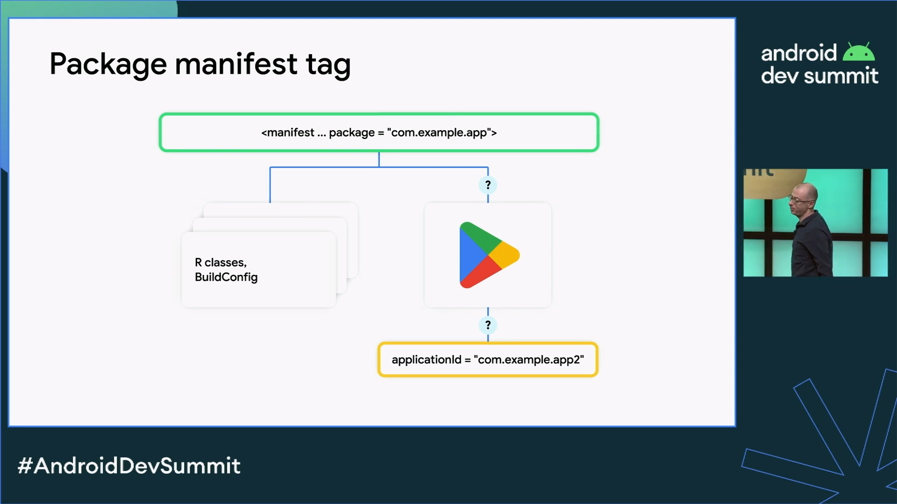
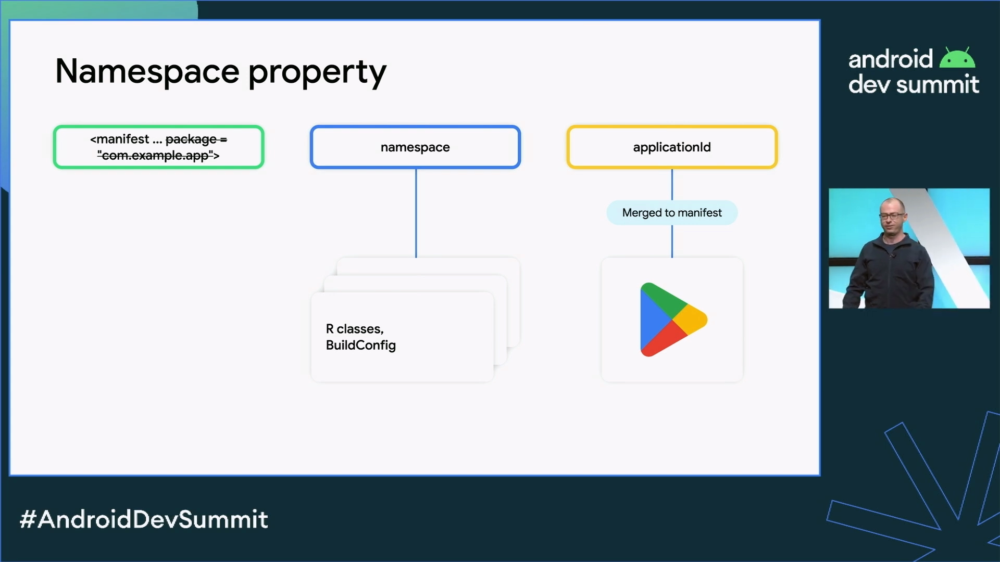

Trouble ID `2024-04-16.android-manifest-tools-replace-conflict`

# Android manifest `tools:replace` 충돌

```
Multiple entries with same key: android:allowBackup=REPLACE and tools:allowBackup=REPLACE.
```

`AndroidManifest.xml` 의 `tools:replace` 는 manifest XML을 병합하는 시점에 충돌하는 노드<sup>node</sup>가 병합되도록 정의되어 있을 때 (`tools:node="merge"`) 해당 노드의 속성<sup>attribute</sup> 값 중에서 대체되어야 할 이름을 나타낸다 (`tools:replace="allowBackup"` 따위로; 자식<sup>child</sup> 노드는 노드의 목록으로 병합되며, 자식 노드 중에도 마찬가지로 스키마<sup>schema</sup>에 의해 유일하게 정의되어야 할 노드 간에 충돌이 있는 경우 그 처리는 해당 노드의 `tools:node` 와 `tools:replace` 로 정해짐).

이는 원리상 APK 아티팩트를 만드는 `application` 프로젝트에서 정해야 하지 `library` 프로젝트에서는 관여할 일이 없는 게 올바른 사항으로, 만약 여러 외부 라이브러리 의존성에 `tools:replace` 값이 정해져 있는 경우 &mdash; 이는 AAR 파일을 통해 전달되는데 &mdash; manifest merger 는 양쪽에서 지시한 속성 값 중 어느 쪽을 버리고 이를 어느 다른 쪽으로 대체하여 따라야 할지 정할 수 없을 것이다. 실제로 이런 충돌의 경우 빌드가 되지 않는 현상이 있다.

> There is a library which defined `android:allowBackup=true` conflicts with yours (`android:allowBackup=false`). You wanna to override it using `tools:replace="android:allowBackup"`, but find that `tools:replace="android:allowBackup"` is also present at lib's manifest, finally the conflict shows above. (Also see [this](http://stackoverflow.com/questions/35131182/manifest-merge-in-android-studio))
>
> ----
>
> <https://github.com/2BAB/Seal>/README.md

이 문제는 일정한 프로젝트의 코드와 의존성 구성이더라도 환경에 따라 재현이 안 되기도 하는데, 재현된다면 열심히 고칠 수밖에 없다. Gradle 작업이 `process[ApplicationVariant]Manifest` 단계에서 실패하면 `assemble[ApplicationVariant]` 수준은 실패할 수밖에 없기 때문이고, 이 문제는 manifest log 도 남기지 않기 때문이다. 방법은 두 가지.

1. 정석대로, Maven 저장소에 AAR 아티팩트를 배포하는 라이브러리 프로젝트 원본을 수정하여 재배포한다.
  - `android:allowBackup="false"` 라느니 `tools:replace="android:allowBackup"` 이니 하는 구문은 라이브러리 프로젝트에 존재할 이유가 없다. 라이브러리가 activity 나 service 따위를 제공하거나, 더 나아가 다소간에 프레임워크 역할을 하는 경우가 있지만 `Application` 클래스를 지정하는 프레임워크 수준이 아니라면 이런 구문은 전부 삭제한다.
2. `application` 프로젝트는 그래도 이 문제에 면역력이 있는 편이다. AGP, build-tools 가 매끄럽게 작동하게 해 준다.
  - `<manifest>` 의 낡은 `package="..."` 속성 구문을 전부 삭제한다. \[1\]
  - Gradle 프로젝트에 `library` 프로젝트 모듈이 있다면, 이들의 `<application>` 태그에서 속성 값을 모두 삭제한다. 또한 `library` 프로젝트에서 문제 있는 라이브러리 의존성 동작 명세 `implementation` 에서 `compileOnly` 로 변경하고, `application` 프로젝트에서 `implementation` 의존성을 갖게 한다.
  - 낡은 구문을 청소하다 보면&hellip; 오류 메시지는 어느 라이브러리 간에 `tools:replace` 충돌이 일어났는지 알려주기도 한다&hellip;.
3. Seal 같은 걸 써서 `beforeMerge`, `afterMerge` 규칙으로 때워 본다.

~~그렇다. 방법은 당신의 관점에 따라 한 가지일 수도 있고 세 가지일 수도 있다.~~

fyi: `allowBackup` 속성은 deprecated 라고 한다. 다만 쓰지 않아도 무방한 상태는 아니고 클라우드 백업과 디바이스간 전송에 대한 정책을 기다려 봐야 할 것 같다. 이런 빌드 메시지가 있다.

```
The attribute android:allowBackup is deprecated from Android 12 and higher and may be removed in future versions.
```

Android 12 (S; API 31) 릴리스 노트에 이미 다음과 같이 공지된 바 있다. Android 6.0 (Marshmallow; API 23) 시기부터 쓰이던 `android:fullBackupContent`, `android:fullBackupOnly` 는 새 규칙으로 대체되어 `android:dataExtractionRules` 를 사용해야 한다. 어찌되었든 아주 기민하게 움직이지 않는다면 모바일 OS 는 사용자 편의를 제공하기 위해 끊임없이 백업과 기기 간 데이터 이전을 지원하려 할 것이다, 로컬 데이터를 모조리 손쉽게 우리 앱의 특정 설치 인스턴스에만 한정시켜 둔다는 보안 개념은 너무 연약한 것일지도 모른다. 빌드 툴체인까지 통합된 수준이라면 모를까 일개 라이브러리는 그런 정책을 강제할 수 있을 가망이 더욱 없다.

> **D2D transfer functionality changes**
>
> For apps running on and targeting Android 12 and higher:
>
> - [Specifying include and exclude rules](https://developer.android.com/guide/topics/data/autobackup#IncludingFiles) with the XML configuration mechanism doesn't affect D2D transfers, though it still affects cloud-based backup and restore (such as Google Drive backups). To specify rules for D2D transfers, you must use the new configuration covered in the next section.
> - On devices from some device manufacturers, specifying `android:allowBackup="false"` does disable backups to Google Drive, but doesn't disable D2D transfers for the app.
>
> ----
>
> Android 12 &mdash; *Behavior changes: apps targeting Android 12* &sect; Backup and restore. <https://developer.android.com/about/versions/12/behavior-changes-12#functionality-changes>

----

\[1\] Android Dev Summit 2022 &mdash; *What's New in Android Build.* <https://www.youtube.com/watch?v=WZ1A7aoEHSw>




